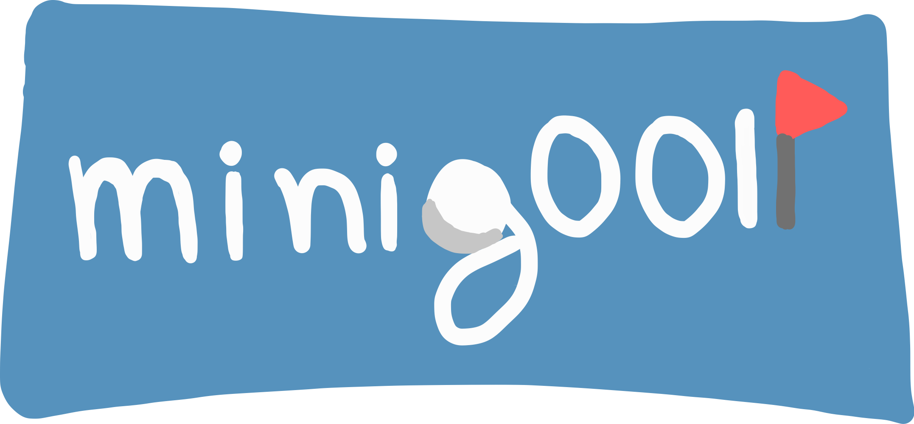

<p align="center">
  
</p>

<p align="center">
  <em>Un simulatore di mini-golf 2D sviluppato con Java e Swing.</em>
</p>


## 📝 Descrizione
Il software è un gioco di mini-golf in due dimensioni per uno o più giocatori in modalità a turni. Il giocatore controlla una pallina su una mappa con ostacoli e superfici di diverso tipo, con l'obiettivo di farla entrare nella buca nel minor numero di colpi possibile. Il sistema di controllo è intuitivo: ogni colpo viene effettuato trascinando il mouse dalla pallina in direzione opposta a quella desiderata, calibrando così potenza e traiettoria. Il gioco è strutturato in una sequenza di mappe (partendo da un tutorial iniziale seguito da livelli in ordine casuale), al termine delle quali i punteggi vengono salvati in una classifica globale.

### Tutorial
Ogni partita inizia con una mappa di tutorial che introduce le meccaniche di gioco e le superfici di diverso tipo. Al termine del tutorial, il gioco procede con una serie di livelli in ordine casuale.

## ✨ Caratteristiche Principali
* **Multiplayer Locale (a turni):** Gioca da solo o sfida fino a 10 amici sullo stesso computer.
* **Fisica Dinamica:** La pallina reagisce in modo realistico a diverse superfici.
* **Ostacoli Interattivi:** Supera muri, ostacoli rimbalzanti e portali di teletrasporto.
* **Generazione Casuale:** Dopo il livello di tutorial, l'ordine delle mappe cambia a ogni partita.
* **Sistema di Salvataggio:** Interrompi la partita in qualsiasi momento e riprendila più tardi senza perdere i progressi.
* **Leaderboard Globale:** I punteggi finali di ogni partita vengono registrati in una classifica persistente per decretare il campione assoluto.

## 🎮 Controlli di Gioco
* **Tiro:** Tieni premuto il `Tasto Sinistro del Mouse` sulla pallina e trascina in direzione opposta, rilascia per tirare. Più allontani il cursore, maggiore sarà la potenza del tiro!
* **Pausa:** Premi `ESC` durante la partita per aprire il menu di pausa, dove potrai consultare il tutorial, salvare o tornare al menu.

## 🏗️ Architettura
Il progetto è stato sviluppato seguendo rigorosamente il pattern architetturale **MVC (Model-View-Controller)**, garantendo un forte disaccoppiamento tra la logica di dominio (fisica e stato del gioco), la gestione del flusso (tramite Controller gerarchici) e l'interfaccia utente (basata su Java Swing).

## 📋 Requisiti
* **Java 17** o superiore

## 🚀 Come Eseguire il Gioco

1. Clona la repository:
   ```bash
   git clone [https://github.com/jjacomo/OOP25-mini-gOOlf.git](https://github.com/jjacomo/OOP25-mini-gOOlf.git)

2. Spostati nella directory del progetto:
   ```bash
   cd OOP25-mini-gOOlf

3. Esegui il gioco:
   ```bash
   java -jar OOP25-mini-gOOlf-all.jar


### 🔨 Build da sorgente

#### Esegui direttamente con Gradle
```bash
./gradlew run
```
> Su Windows usa `gradlew.bat run` al posto di `./gradlew run`.

In alternativa, puoi generare il JAR eseguibile (fat jar) con il seguente comando:

```bash
./gradlew shadowJar
```
Il file JAR verrà creato in `build/libs/OOP25-mini-gOOlf-all.jar` e può essere avviato con:
```bash
java -jar build/libs/OOP25-mini-gOOlf-all.jar
```

## 🧪 Eseguire i test
```bash
./gradlew test
```
I risultati dei test vengono generati in `build/reports/tests/test/index.html`.
