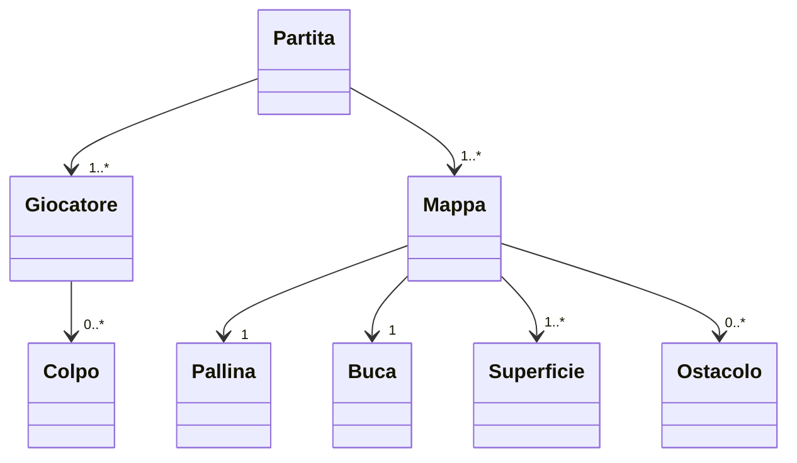

## Capitolo 1:  Analisi

### 1.1 Descrizione e requisiti

Il software è un gioco di mini-golf in 2D per uno o più giocatori in modalità a turni. Il giocatore controlla una pallina su una mappa con ostacoli e superfici di diverso tipo, con l'obiettivo di farla entrare nella buca nel minor numero di colpi possibile.
Purchè esso sia minore o uguale a 7. Ogni colpo viene effettuato trascinando il mouse dalla pallina nella direzione desiderata, ma verso opposto, e più lungo è il trascinamento, più potente sarà il colpo.
Il gioco è composto da più mappe in sequenza. Al termine di ogni mappa viene mostrata una classifica intermedia con i colpi effettuati da ciascun giocatore. Al termine di tutte le mappe i punteggi vengono salvati nella classifica finale.

#### Requisiti funzionali
* Gestione dell'input
* Menu di gioco
* Mappa e ostacoli
* Movimento della pallina
(Questi li scriverei sotto forma di frasi complete come nell'esempio slide 5) -fede

#### Requisiti non funzionali
* Leaderboard
* Possibilità di salvare e caricare la partita
* Terreni ed ostacoli di tipo avanzato 
(Questi li scriverei sotto forma di frasi complete come nell'esempio slide 5) -fede

### 1.2 Modello del Dominio

Un gioco di mini-golf è composto da una sequenza di mappe. Ogni mappa contiene una pallina, una buca, un insieme di superfici e un insieme di ostacoli. La pallina si muove sulla mappa seguendo le leggi della fisica: la superficie su cui si trova influenza il suo movimento tramite l'attrito e, in alcuni casi, il vento. Gli ostacoli bloccano il percorso della pallina facendola rimbalzare.
Una partita coinvolge uno o più giocatori che si alternano a turni. Ad ogni turno il giocatore effettua un colpo, indicando direzione e potenza. Il punteggio di ciascun giocatore su una mappa corrisponde al numero di colpi effettuati. L'obiettivo è far entrare la pallina nella buca.

UML: (da controllare e commentare quando ci saremo tutti, per ora è una base)


## Capitolo 2: Design

### 2.1 Architettura


### 2.2 Design dettagliato

#### Daniel Patryk Bak
**Topic**
*Problema*:

*Soluzione*: 

*Pro e Contro*: 

#### Giacomo Mengozzi
**Superfici**
*Problema*: 
Il gioco _mini-gOOlf_ richiede di avere superfici con diverse proprietà fisiche (attrito, boost, vento), che impattano il comportamento della pallina. Il gioco prevede 4 diverse superfici di base che differiscono solo per attrito: erba, sabbia, ghiaccio, terra.
Si vogliono implementare superfici avanzate

*Soluzione*:
La progettazione e' basata su una interfaccia `Surface` che definisce le proprieta' comuni a tutte le superfici.

*Pro e Contro*: 

#### Federico Sparvoli

**Input del colpo**

*Problema*:
Il gioco richiede che il giocatore indichi direzione e potenza del colpo trascinando il mouse dalla pallina. Il sistema deve riconoscere dove inizia il trascinamento, calcolare la direzione e la potenza, mostrare un indicatore visivo, e confermare il colpo solo al rilascio del mouse.

*Soluzione*:
La logica è suddivisa in tre livelli distinti seguendo il pattern MVC:
- Model (ShotState): tiene traccia dello stato del colpo in corso. Espone lo stato tramite interfacce strette invece che come oggetto diretto, evitando dipendenze indesiderate.
- View (ShotViewPanel, ShotListener): ShotListener riceve gli eventi del mouse e li traduce in aggiornamenti sul model, dipendendo solo da due interfacce strette (ShotVisualizer e ShotCoordinateConverter) invece che dalla classe concreta. Questo applica il pattern Strategy: il comportamento di disegno e conversione delle coordinate è intercambiabile senza modificare il listener.
- Controller (ShotControllerImpl): ogni tick interroga il model e, se un colpo è pronto, lo passa alla logica di turno tramite callback, senza memorizzare riferimenti a oggetti mutabili.

UML:
```mermaid
    classDiagram
        class ShotListener
        <<interface>> ShotVisualizer
        <<interface>> ShotCoordinateConverter
        class ShotViewPanel

        ShotListener --> ShotVisualizer
        ShotListener --> ShotCoordinateConverter
        ShotViewPanel ..|> ShotVisualizer
        ShotViewPanel ..|> ShotCoordinateConverter
```

*Pro e Contro*:
Pro: separazione netta tra stato, rendering e coordinamento. Aggiungere un nuovo tipo di indicatore visivo richiede solo una nuova implementazione di ShotVisualizer, senza toccare il listener o il controller.

Contro: la soglia di click sulla pallina è una costante fissa in pixel logici, e non si adatta automaticamente se la pallina cambia dimensione.

**Ciclo di vita del match e progressione delle mappe**

*Problema*:
Il gioco deve supportare più mappe in sequenza. Quando la pallina entra in buca si avanza alla mappa successiva; se non ce ne sono, si torna al menu. Tutta questa logica non deve stare nel controller principale, che deve restare semplice.

*Soluzione*:
La progressione di gioco è gestita da tre componenti distinte:
-MapSequence (model): tiene la lista ordinata delle mappe e sa qual è la corrente. Applica il pattern Factory Method: ogni mappa è prodotta da una GameMapFactory, rendendo semplice aggiungerne di nuove.
-Gamefactory: costruisce il match per la mappa corrente, collegando tutti i componenti necessari.
-MatchManager (controller): usa GameFactory per costruire ogni match e gestisce le transizioni tra una mappa e l'altra. Comunica con il resto del sistema solo tramite callback, senza memorizzare oggetti mutabili.

UML:
```mermaid
    classDiagram
        class MatchManager
        class MapSequence
        <<interface>> GameMapFactory
        class FirstMap
        class SecondMap

        MatchManager --> MapSequence
        MapSequence --> GameMapFactory
        GameMapFactory <|.. FirstMap
        GameMapFactory <|.. SecondMap
```

*Pro e Contro*:
Pro: aggiungere una nuova mappa richiede solo di creare una nuova classe e aggiungerla alla sequenza. Il reset al ritorno al menu è automatico.

Contro: ad ogni cambio mappa il match viene ricostruito da zero, il che potrebbe rallentare il gioco se le mappe fossero molto complesse.

#### Mattia D'Ambrosio
**Topic**
*Problema*: 

*Soluzione*:

*Pro e Contro*: 

---

## Capitolo 3: Sviluppo

### 3.1 Testing automatizzato
* **Daniel Patryk Bak:** 
* **Giacomo Mengozzi:** 
* **Federico Sparvoli:** 
I componenti testati sono ShotState, GameState e GameFactory.
ShotStateTest: controlla che lo stato del tiro funzioni bene: all'inizio è vuoto, c'è una potenza minima, la potenza massima non si può superare, si può consumare un colpo e si può resettare tutto.

GameStateTest: controlla la logica dei turni: come si crea, come si passa al turno successivo (e si ricomincia da capo dopo l'ultimo), quanti colpi sono stati fatti, e che i colpi troppo deboli o fatti mentre la pallina si muove vengano ignorati.

GameFactoryTest: controlla che la partita creata dalla factory sia sempre uguale all'inizio su entrambe le mappe: tutti i controller devono essere presenti, il primo giocatore è quello giusto, e lo stato del tiro è vuoto.

* **Mattia D'Ambrosio:** 

### 3.2 Note di sviluppo
* **Daniel Patryk Bak:** 
* **Giacomo Mengozzi:** 
* **Federico Sparvoli:** 
-Lambda expressions e method reference: utilizzate per passare comportamenti e dipendenze in modo semplice e flessibile. GameControllerImpl non memorizza né GameState né PhysicsController direttamente, ma ne estrae i comportamenti come BooleanSupplier, Runnable, Consumer<Vector2D> e Supplier<Optional<Vector2D>>, eliminando i warning SpotBugs EI_EXPOSE_REP2 senza fare uso di alcun @SuppressWarnings.
Permalink:  https://github.com/jjacomo/OOP25-mini-gOOlf/blob/87cc252b172c4386b3ddc03454383d9d96ed44cf/src/main/java/it/unibo/minigoolf/controller/game/GameControllerImpl.java#L104
    https://github.com/jjacomo/OOP25-mini-gOOlf/blob/87cc252b172c4386b3ddc03454383d9d96ed44cf/src/main/java/it/unibo/minigoolf/controller/game/MatchManager.java#L78

-Record Java: SaveData e PlayerSaveData sono record utilizzati per rappresentare dati in modo semplice e immutabile.
Permalink: https://github.com/jjacomo/OOP25-mini-gOOlf/blob/87cc252b172c4386b3ddc03454383d9d96ed44cf/src/main/java/it/unibo/minigoolf/model/save/SaveData.java#L21

-Stream API: usata in GameState per costruire la lista dei giocatori nel costruttore, in GameControllerImpl per produrre gli snapshot dei giocatori in createSaveData, e in MatchManager per avanzare la sequenza di mappe al caricamento di un salvataggio.
Permalink: https://github.com/jjacomo/OOP25-mini-gOOlf/blob/87cc252b172c4386b3ddc03454383d9d96ed44cf/src/main/java/it/unibo/minigoolf/model/logic/GameState.java#L43 //TODO

-Optional: usato in ShotState per indicare se c'è o meno un'intenzione di tiro, posizione della palla e colpo pronto, rendendo esplicito il ciclo di vita del colpo ed evitando controlli su null.
Permalink: https://github.com/jjacomo/OOP25-mini-gOOlf/blob/87cc252b172c4386b3ddc03454383d9d96ed44cf/src/main/java/it/unibo/minigoolf/model/logic/ShotState.java#L68

-Libreria Gson (com.google.code.gson): usata in SaveManager per serializzare e deserializzare lo stato della partita in JSON con GsonBuilder.setPrettyPrinting().
Permalink: https://github.com/jjacomo/OOP25-mini-gOOlf/blob/87cc252b172c4386b3ddc03454383d9d96ed44cf/src/main/java/it/unibo/minigoolf/model/save/SaveManager.java#L21

* **Mattia D'Ambrosio:** 

---

## Capitolo 4: Commenti finali

### 4.1 Autovalutazione e lavori futuri
* **Daniel Patryk Bak:** 
* **Giacomo Mengozzi:** 
* **Federico Sparvoli:** 
Il mio contributo principale riguarda il sistema di input del colpo, la gestione del ciclo di vita dei match e il sistema di salvataggio. Sono soddisfatto della separazione raggiunta tra model, view e controller, in particolare dell'eliminazione di tutti i warning SpotBugs senza ricorrere a @SuppressWarnings, ottenuta tramite interfacce strette e callback funzionali.
Un aspetto migliorabile è la soglia di click sulla pallina (CLICK_RADIUS), che al momento è un numero fisso di pixel e non cambia se la pallina viene ingrandita o rimpicciolita. In futuro sarebbe meglio calcolarlo in base al raggio vero della pallina.
Per quanto riguarda il cambio delle mappe, al momento ricostruiamo da capo tutto il controller del gioco ad ogni nuova mappa. Con mappe molto grandi questo potrebbe rallentare il gioco. Il prossimo passo sarebbe caricare le mappe in anticipo, senza bloccare il gioco.
Il sistema di salvataggio (SaveManager, SaveData) memorizza la partita in formato JSON usando Gson. Salva solo il numero della mappa, non tutta la geometria. Così i file sono piccoli e il salvataggio non dipende da come sono fatte le mappe dentro. Un limite attuale è che il salvataggio viene cancellato appena lo si carica, quindi non si può riprendere la stessa partita due volte senza salvarla di nuovo.

* **Mattia D'Ambrosio:** 

---

## Appendice A: Guida Utente

* **Menu Iniziale:** 
* **Azioni di Gioco:** 
* **Controlli In-Game:** 
* **Fine Partita:**

(per me è abbastanza banale e si potrebbe anche omettere, al massimo spieghiamo le regole del gioco)