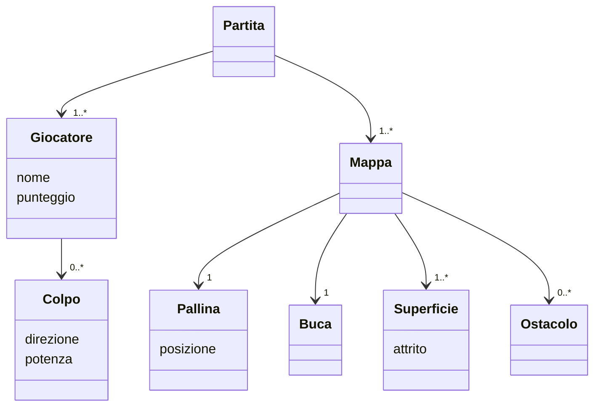
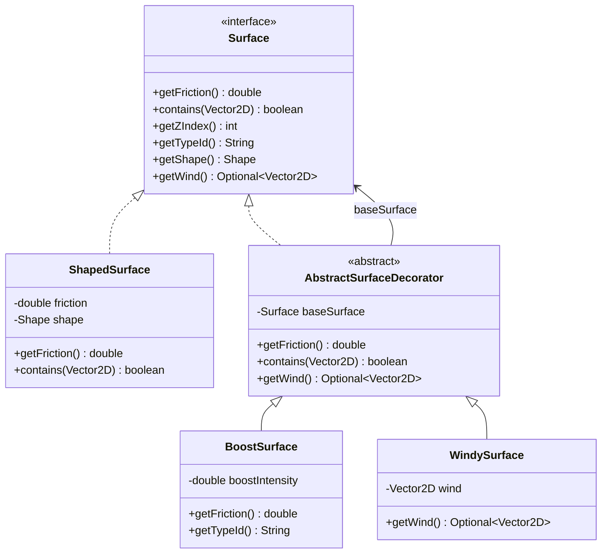
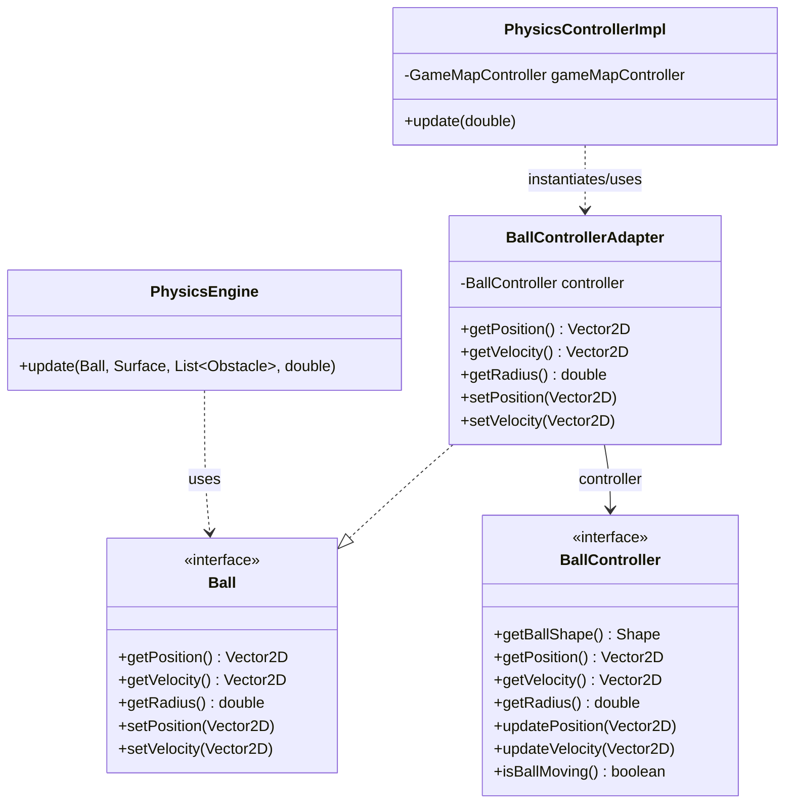
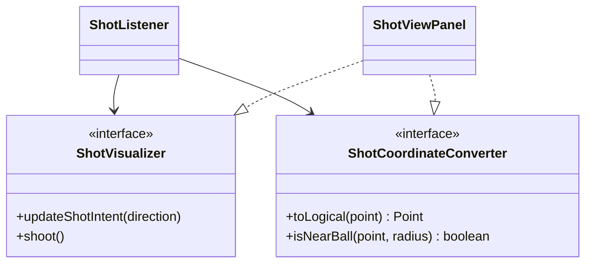
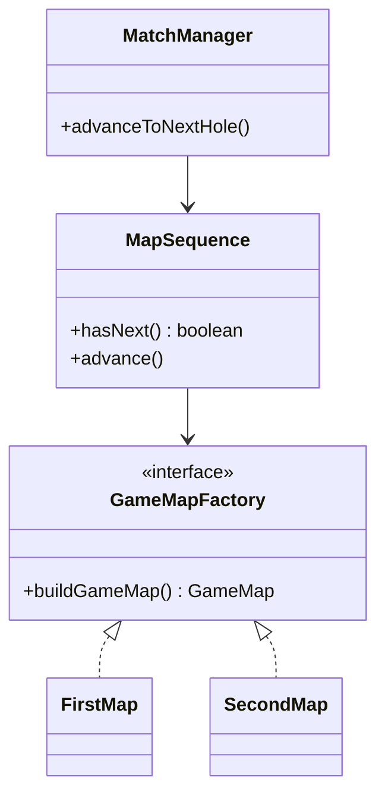
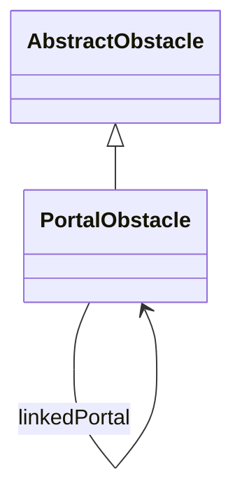

## Indice

# Capitolo 1:  Analisi

## 1.1 Descrizione e requisiti

Il software è un gioco di mini-golf in due dimensioni per uno o più giocatori in modalità a turni. Il giocatore controlla una pallina su una mappa con ostacoli e superfici di diverso tipo, con l'obiettivo di farla entrare nella buca nel minor numero di colpi possibile. Ogni colpo viene effettuato trascinando il mouse dalla pallina nella direzione desiderata e verso opposto. Il gioco è composto da più mappe, una iniziale di tutorial, le altre in ordine casuale, al termine delle quali i punteggi vengono salvati nella classifica finale.

### 1.1.1 Requisiti funzionali
* Il giocatore effettua un colpo trascinando il mouse dalla pallina: la direzione e la potenza sono determinate dalla posizione del cursore rispetto alla pallina, un indicatore visivo mostra in tempo reale direzione e potenza del colpo durante il trascinamento.
* Il gioco supporta più giocatori in modalità a turni.
* La pallina interagisce con ostacoli di forme diverse e superfici con proprietà fisiche differenti, tra cui terreni che rallentano o modificano la traiettoria.
* Al completamento di ogni mappa viene mostrata una classifica intermedia con i colpi effettuati da ciascun giocatore

### 1.1.2 Requisiti non funzionali
* Il gioco prevede superfici e ostacoli con proprietà fisiche avanzate.
* È possibile salvare la partita in corso e riprenderla in un secondo momento.
* La classifica finale è persistente tra sessioni diverse e si aggiorna al termine di ogni partita completata.

## 1.2 Modello del Dominio

Un gioco di mini-golf è composto da una sequenza di mappe. Ogni mappa contiene una pallina, una buca, un insieme di superfici e un insieme di ostacoli. La pallina si muove sulla mappa seguendo le leggi della fisica: la superficie su cui si trova influenza il suo movimento tramite l'attrito e, in alcuni casi, il vento. Gli ostacoli bloccano il percorso della pallina facendola rimbalzare e in alcuni casi ne alterano la velocità.
Una partita coinvolge uno o più giocatori che si alternano a turni. Ad ogni turno il giocatore effettua un colpo, indicando direzione e potenza. Il punteggio di ciascun giocatore su una mappa corrisponde al numero di colpi effettuati. L'obiettivo è far entrare la pallina nella buca.

UML:


# Capitolo 2: Design

## 2.1 Architettura


## 2.2 Design dettagliato

### 2.2.1 Daniel Patryk Bak
#### Topic
##### Problema

##### Soluzione

*Pro e Contro*: 

### 2.2.2 Giacomo Mengozzi
#### Superfici avanzate
##### Problema

Il gioco _mini-gOOlf_ richiede di avere superfici con diverse proprietà fisiche (attrito, boost, vento), che impattano il comportamento della pallina. Il gioco prevede 4 diverse superfici di base che differiscono solo per costante di attrito: erba, sabbia, ghiaccio, terra. 

In aggiunta a queste superfici considerate di base si vogliono implementare superfici avanzate con proprieta' aggiuntive in grado di modificare la velocita' della pallina in altri modi.

##### Soluzione
La progettazione e' basata su una interfaccia `Surface` che definisce le proprieta' comuni a tutte le superfici.
La soluzione proposta adotta il **Decorator Pattern** che permette di aggiungere alle superfici ulteriori responsabilita' in modo piu' flessibile rispetto all'ereditarieta'.
Questa scelta ha permesso una semplice implementazione di `WindySurface` e `BoostSurface` che decorano la superficie di base modificando i valori di ritorno dei metodi `getWind` e `getFriction`.

UML:


##### Pro e Contro
Pro: 
* **Componibilità dinamica**: Possibilità di combinare più effetti fisici decorando ricorsivamente la superficie base (es. una superficie può essere contemporaneamente `BoostSurface` e `WindySurface`).
* **Riutilizzo del codice e DRY**: I decoratori riutilizzano l'implementazione geometrica e di contenimento della superficie base, occupandosi unicamente di alterare i parametri fisici (attrito o vento).

Contro:
* **Complessità di inizializzazione**: La creazione di superfici complesse richiede di comporre più oggetti a cascata, il che rende la creazione manuale verbosa se non opportunamente mediata da una Factory.

#### Fisica della pallina

##### Problema
Nel motore fisico `PhysicsEngine`, che risiede nel livello Model, le collisioni e i movimenti della pallina vengono calcolati facendo riferimento all'interfaccia `Ball`. Tuttavia, lo stato e le logiche di controllo della pallina sono gestiti nel livello Controller tramite l'interfaccia `BallController`.

Sorge quindi la necessità di far comunicare e cooperare questi due livelli senza violare i principi dell'architettura MVC:
* **Evitare la duplicazione dello stato**: Mantenere un'istanza separata del modello della pallina e sincronizzarne continuamente le proprietà con il controller introdurrebbe ridondanza e potenziali bug di sincronizzazione.
* **Mantenere il disaccoppiamento**: Il modulo `PhysicsEngine` e le altre classi del Model non devono conoscere o dipendere dalle astrazioni del Controller `BallController`. Viceversa, l'interfaccia del controller non dovrebbe essere forzata a implementare direttamente quella del modello per non contaminare le proprie responsabilità.

##### Soluzione
È stato applicato il design pattern **Adapter**, implementato tramite la classe `BallControllerAdapter`. 
Questa classe:
1. Implementa l'interfaccia target `Ball` (richiesta dal motore fisico).
2. Incapsula un riferimento all'interfaccia adaptee `BallController`.
3. Adatta le chiamate dei metodi delegandole direttamente al controller (ad esempio, traducendo `setPosition(position)` in `controller.updatePosition(position)` e inoltrando le letture come `getPosition()`).

UML:


##### Pro e Contro
**Pro**:
* **Single Source of Truth**: Esiste un unico stato autorevole per la pallina gestito dal controller. Tutte le modifiche apportate dal motore fisico si riflettono istantaneamente e direttamente sullo stato reale, eliminando qualsiasi necessità di codice di sincronizzazione.
* **Disaccoppiamento e Rispetto dell'MVC**: Il motore fisico `PhysicsEngine` e le altre strategie dipendono solo dall'interfaccia `Ball`, rimanendo completamente isolati dal controller. A sua volta, `BallController` rimane focalizzato sulle proprie responsabilità senza essere inquinato da interfacce del modello.
* **Flessibilità**: Se l'interfaccia `Ball` o `BallController` dovesse cambiare, la modifica rimarrebbe localizzata all'interno della classe `BallControllerAdapter`, senza impattare la logica del motore fisico o degli altri componenti.

**Contro**:
* **Sovraccarico di allocazione (overhead)**: Viene istanziato un nuovo oggetto `BallControllerAdapter` a ogni ciclo di aggiornamento della fisica `PhysicsControllerImpl.update`. Sebbene la JVM moderna sia estremamente efficiente nel gestire ed eliminare oggetti a vita breve (grazie alla Garbage Collection generazionale e all'escape analysis), ciò introduce una minima indirection ed allocazione temporanea in memoria durante il game loop.
* **Aumento delle classi**: Aggiunge un ulteriore livello di indirezione con una classe ponte dedicata, aumentando leggermente la complessità strutturale del progetto per scopi puramente architetturali.

### 2.2.3 Federico Sparvoli
#### Input del colpo
##### Problema

Il gioco richiede che il giocatore indichi direzione e potenza del colpo trascinando il mouse dalla pallina. Il sistema deve riconoscere dove inizia il trascinamento, calcolare la direzione e la potenza, mostrare un indicatore visivo, e confermare il colpo solo al rilascio del mouse.

##### Soluzione
La logica è suddivisa in tre livelli distinti seguendo il pattern MVC:
- Model (ShotState): tiene traccia dello stato del colpo in corso. Espone lo stato tramite interfacce strette invece che come oggetto diretto, evitando dipendenze indesiderate.
- View (ShotViewPanel, ShotListener): ShotListener riceve gli eventi del mouse e li traduce in aggiornamenti sul model, dipendendo solo da due interfacce strette (ShotVisualizer e ShotCoordinateConverter) invece che dalla classe concreta. Questo applica il pattern Strategy: il comportamento di disegno e conversione delle coordinate è intercambiabile senza modificare il listener.
- Controller (ShotControllerImpl): ogni tick interroga il model e, se un colpo è pronto, lo passa alla logica di turno tramite callback, senza memorizzare riferimenti a oggetti mutabili.

UML:


##### Pro e Contro
Pro: separazione netta tra stato, rendering e coordinamento. Aggiungere un nuovo tipo di indicatore visivo richiede solo una nuova implementazione di ShotVisualizer, senza toccare il listener o il controller.

Contro: la soglia di click sulla pallina è una costante fissa in pixel logici, e non si adatta automaticamente se la pallina cambia dimensione.

#### Ciclo di vita del match e progressione delle mappe

##### Problema
Il gioco deve supportare più mappe in sequenza. Quando la pallina entra in buca si avanza alla mappa successiva; se non ce ne sono, si torna al menu. Tutta questa logica non deve stare nel controller principale, che deve restare semplice.

##### Soluzione
La progressione di gioco è gestita da tre componenti distinte:
-MapSequence (model): tiene la lista ordinata delle mappe e sa qual è la corrente. Applica il pattern Factory Method: ogni mappa è prodotta da una GameMapFactory, rendendo semplice aggiungerne di nuove.
-Gamefactory: costruisce il match per la mappa corrente, collegando tutti i componenti necessari.
-MatchManager (controller): usa GameFactory per costruire ogni match e gestisce le transizioni tra una mappa e l'altra. Comunica con il resto del sistema solo tramite callback, senza memorizzare oggetti mutabili.

UML:


##### Pro e Contro

Pro: aggiungere una nuova mappa richiede solo di creare una nuova classe e aggiungerla alla sequenza. Il reset al ritorno al menu è automatico.

Contro: ad ogni cambio mappa il match viene ricostruito da zero, il che potrebbe rallentare il gioco se le mappe fossero molto complesse.

### 2.2.4 Mattia D'Ambrosio
#### Fisica, geometria degli ostacoli e gestione vettoriale
##### Problema

Gestire le collisioni fisiche tra la pallina e gli ostacoli di forme diverse (rettangoli, cerchi, triangoli) in modo realistico, anche in situazioni critiche come angoli interni tra ostacoli adiacenti o sotto l’effetto di forze esterne, evitando compenetrazioni, vibrazioni della pallina a riposo (jittering) e rimbalzi innaturali o con direzioni arbitrarie.
Inoltre era necessario implementare il calcolo vettoriale senza importare librerie esterne pesanti.

##### Soluzione
- Le normali di collisione sono pre calcolate per ogni lato (rettangolo, triangolo) o derivabili geometricamente (cerchio).
- Negli angoli dei triangoli, le normali dei lati vengono sommate per ottenere la bisettrice perfetta, rendendo il rimbalzo deterministico ed eliminando scelte arbitrarie.
- La profondità di penetrazione viene sfruttata per riposizionare la pallina fuori dall'ostacolo, prima di calcolare il rimbalzo. Nelle collisioni multiple, tramite "deepest penetration first", si individua l'ostacolo con compenetrazione maggiore (quello effettivamente impattato per primo).
- 'AbstractObstacle' (model): Centralizza la logica di calcolo del rimbalzo e del resting contact, evitando ripetizioni di codice nelle sottoclassi.
- 'Vector2D': classe personalizzata che fornisce solo i metodi necessari a creare e fare calcoli coi vettori, alleggerendo il gioco.

UML:
```mermaid
    classDiagram
            <<interface>> Obstacle
            class AbstractObstacle
            class WallObstacle
            class RoundObstacle
            class TriangleObstacle
            class Vector2D

            Obstacle <|.. AbstractObstacle
            AbstractObstacle <|-- WallObstacle
            AbstractObstacle <|-- RoundObstacle
            AbstractObstacle <|-- TriangleObstacle
            AbstractObstacle --> Vector2D
```

##### Pro e Contro
Pro:
- Fisica altamente stabile e realistica 
- Le normali precalcolate riducono drasticamente i calcoli ripetitivi nel game loop (specialmente nei rettangoli).
- La classe personalizzata 'Vector2D' evita di importare tutti i metodi e campi non necessari all'applicazione, alleggerendola
- Architettura scalabile: l'aggiunta di un nuovo ostacolo richiede solo di estendere 'AbstractObstacle' ed implementare il calcolo di compenetrazione.

Contro:
- Se la velocità della pallina in un singolo frame supera lo spessore dell'ostacolo, rischia di attraversarlo (tunneling).
- Il calcolo esatto delle distanze per i triangoli richiede l'estrazione di radici quadrate, operazione che appesantiscono il game loop.

#### Creazione degli ostacoli avanzati (Appiccicosi, Rimbalzanti e Portali)

##### Problema
Introdurre dinamiche di gioco avanzate tramite ostacoli che alterano la velocità della pallina (appiccicosi che rallentano, respingenti che accelerano) e portali di teletrasporto. Bisognava evitare di creare una nuova classe per ogni combinazione di forma ed effetto, garantire la creazione sicura dei portali solo in coppia e prevenire loop infiniti di teletrasporto nello stesso frame.

##### Soluzione
- Constructor Chaining per l'elasticità: Aggiunto il parametro `bounciness` in `AbstractObstacle`, che scala la velocità al contatto con l'ostacolo senza alterare l'angolo di rimbalzo.
- Aggiunto un secondo costruttore, in ogni classe degli ostacoli, che accetta come parametro 'bounciness' per creare l'ostacolo elastico. In caso di ostacoli con elasticità normale, si utilizza il costruttore base, che chiamerà quello completo impostando 'bounciness' al valore di default.
- Il costruttore di `PortalObstacle` è privato e la creazione è delegata al metodo statico `createPair()`, che istanzia e collega tra loro due portali in memoria, impedendo la configurazione di elementi dispari o spaiati nella mappa.
- Al momento del teletrasporto, il portale di destinazione attiva un 'timer di cooldown'; finché è attivo, la sua compenetrazione risulta nulla, nascondendolo temporaneamente al motore fisico per permettere alla pallina di uscire senza re-innescare il trasferimento.

UML:


##### Pro e Contro
Pro:
- Architettura estremamente flessibile: gli effetti di accelerazione e decelerazione possono essere applicati a qualsiasi forma geometrica tramite un semplice parametro.
- Sicurezza strutturale nella creazione dei portali, che impedisce stati invalidi come la creazione di portali spaiati.

Contro:
- Il cooldown temporale fisso (es. 500ms) potrebbe scadere prima che la pallina sia uscita dal portale se questa viaggia a una velocità estremamente ridotta, generando un loop.

#### Architettura e separazione Vista‑Logica

##### Problema
La logica di gestione degli ostacoli (collisioni, calcoli fisici, accesso ai dati) deve essere separata dalla rappresentazione grafica e dal resto del gioco, per mantenere un’architettura MVC pulita ed evitare che la vista dipenda direttamente dalle classi del modello.

##### Soluzione
- Introdotto `ObstacleController` che agisce da intermediario isolando i dati fisici da quelli visivi. Espone i metodi `getObstacles()` (per i modelli) e `getObstacleShapes()` (per il rendering).
- Il motore fisico (`PhysicsEngine`) interroga il controller tramite `getObstacles()` per ottenere esclusivamente i modelli matematici necessari a risolvere le collisioni in ogni frame.
- La vista (`MapPanel`) chiede le forme geometriche da disegnare senza conoscere i dettagli interni del modello. Leggendo le proprietà fisiche degli ostacoli (come la `bounciness` o il tipo `PortalObstacle`), la vista decide autonomamente il colore di rendering (verde, rosso, blu o grigio di default) prima di delegare il disegno della forma.

UML:
```mermaid
    classDiagram
        class MapPanel
        <<interface>> ObstacleController
        <<interface>> Obstacle
        <<interface>> Shape

        MapPanel --> ObstacleController
        ObstacleController --> Obstacle
        Obstacle --> Shape
```

##### Pro e Contro
Pro:
- Separazione netta tra modello e vista, che garantisce un'ottima manutenibilità e facilità di test automatizzati.
- Modificare l'aspetto estetico o i colori di un ostacolo richiede modifiche circoscritte alla sola vista, senza rischiare di alterare i calcoli fisici del modello.

Contro:
- L'aggiunta di un controllore dedicato aumenta il numero di interfacce e di file da gestire nel progetto, rendendo l'architettura iniziale più complessa da configurare.
- La vista ('MapPanel') deve comunque guardare dentro le proprietà del modello (usando controlli come 'instanceof' o leggendo la 'bounciness') per decidere il colore da associare, creando un legame tra l'aspetto grafico e la logica interna degli ostacoli.

---

# Capitolo 3: Sviluppo

## 3.1 Testing automatizzato
### 3.1.1 Daniel Patryk Bak
### 3.1.2 Giacomo Mengozzi
### 3.1.3 Federico Sparvoli
I componenti testati sono ShotState, GameState e GameFactory.
ShotStateTest: controlla che lo stato del tiro funzioni bene: all'inizio è vuoto, c'è una potenza minima, la potenza massima non si può superare, si può consumare un colpo e si può resettare tutto.

GameStateTest: controlla la logica dei turni: come si crea, come si passa al turno successivo (e si ricomincia da capo dopo l'ultimo), quanti colpi sono stati fatti, e che i colpi troppo deboli o fatti mentre la pallina si muove vengano ignorati.

GameFactoryTest: controlla che la partita creata dalla factory sia sempre uguale all'inizio su entrambe le mappe: tutti i controller devono essere presenti, il primo giocatore è quello giusto, e lo stato del tiro è vuoto.

### 3.1.4 Mattia D'Ambrosio
I componenti testati riguardano la geometria computazionale e la fisica delle collisioni: Vector2D, Obstacle (con le sue classi concrete) e ObstacleController.

Vector2DTest: Controlla la correttezza di tutte le operazioni algebriche fondamentali sui vettori custom (somma, sottrazione, normalizzazione, prodotto scalare, distanza euclidea e gestione dei limiti della precisione floating-point tramite EPSILON).

ObstacleCollisionTest: Verifica l'accuratezza del calcolo delle collisioni e della profondità di penetrazione per WallObstacle, RoundObstacle e TriangleObstacle. Testa i casi limite, come l'allineamento perfetto dei centri, l'impatto sugli spigoli vivi e l'espulsione fisica della pallina quando si trova sia all'esterno che completamente all'interno dei solidi.

ObstacleControllerTest: Assicura il corretto funzionamento del controller come intermediario. Verifica che la lista dei modelli matematici (Obstacle) e delle forme grafiche (Shape) siano popolate coerentemente e che il motore fisico riceva i dati corretti per la risoluzione dei contatti in ogni frame.

## 3.2 Note di sviluppo
### 3.2.1 Daniel Patryk Bak
### 3.2.2 Giacomo Mengozzi
### 3.2.3 Federico Sparvoli
-Lambda expressions e method reference: utilizzate per passare comportamenti e dipendenze in modo semplice e flessibile. GameControllerImpl non memorizza né GameState né PhysicsController direttamente, ma ne estrae i comportamenti come BooleanSupplier, Runnable, Consumer<Vector2D> e Supplier<Optional<Vector2D>>, eliminando i warning SpotBugs EI_EXPOSE_REP2 senza fare uso di alcun @SuppressWarnings.
Permalink:  https://github.com/jjacomo/OOP25-mini-gOOlf/blob/87cc252b172c4386b3ddc03454383d9d96ed44cf/src/main/java/it/unibo/minigoolf/controller/game/GameControllerImpl.java#L104
    https://github.com/jjacomo/OOP25-mini-gOOlf/blob/87cc252b172c4386b3ddc03454383d9d96ed44cf/src/main/java/it/unibo/minigoolf/controller/game/MatchManager.java#L78

-Record Java: SaveData e PlayerSaveData sono record utilizzati per rappresentare dati in modo semplice e immutabile.
Permalink: https://github.com/jjacomo/OOP25-mini-gOOlf/blob/87cc252b172c4386b3ddc03454383d9d96ed44cf/src/main/java/it/unibo/minigoolf/model/save/SaveData.java#L21

-Stream API: usata in GameState per costruire la lista dei giocatori nel costruttore, in GameControllerImpl per produrre gli snapshot dei giocatori in createSaveData, e in MatchManager per avanzare la sequenza di mappe al caricamento di un salvataggio.
Permalink: https://github.com/jjacomo/OOP25-mini-gOOlf/blob/87cc252b172c4386b3ddc03454383d9d96ed44cf/src/main/java/it/unibo/minigoolf/model/logic/GameState.java#L43 //TODO

-Optional: usato in ShotState per indicare se c'è o meno un'intenzione di tiro, posizione della palla e colpo pronto, rendendo esplicito il ciclo di vita del colpo ed evitando controlli su null.
Permalink: https://github.com/jjacomo/OOP25-mini-gOOlf/blob/87cc252b172c4386b3ddc03454383d9d96ed44cf/src/main/java/it/unibo/minigoolf/model/logic/ShotState.java#L68

-Libreria Gson (com.google.code.gson): usata in SaveManager per serializzare e deserializzare lo stato della partita in JSON con GsonBuilder.setPrettyPrinting().
Permalink: https://github.com/jjacomo/OOP25-mini-gOOlf/blob/87cc252b172c4386b3ddc03454383d9d96ed44cf/src/main/java/it/unibo/minigoolf/model/save/SaveManager.java#L21

### 3.2.4 Mattia D'Ambrosio
Ereditarietà e Polymorphism (Pattern Template Method): Utilizzati nella gerarchia degli ostacoli per massimizzare il riutilizzo del codice (DRY). La classe astratta AbstractObstacle definisce lo scheletro dell'algoritmo di calcolo del rimbalzo e della correzione della posizione (metodo 'reflectVelocity'), lasciando alle classi concrete solo il compito di implementare le specificità geometriche di calcolo della penetrazione e delle normali.

Constructor Chaining: Applicato in tutte le classi degli ostacoli per introdurre la 'bounciness', garantendo la compatibilità con il codice già esistente. I costruttori base delegano la creazione a costruttori più completi passando automaticamente il valore di default, evitando ridondanze o controlli duplicati.

Pattern Static Factory Method: Utilizzato nella classe PortalObstacle. Avendo reso privato il costruttore, la creazione dei portali è vincolata al metodo statico 'createPair()'. Questo approccio impedisce la configurazione di stati invalidi nel sistema, come la presenza di portali dispari, spaiati o non collegati bidirezionalmente in memoria.

System Timestamping: Sfruttato all'interno della gestione dei portali tramite 'System.currentTimeMillis()' per implementare un meccanismo di cooldown temporale deterministico. Questo permette di disattivare temporaneamente la fisica di un portale per una finestra temporale fissa, prevenendo loop infiniti di teletrasporto nello stesso frame.

---

# Capitolo 4: Commenti finali

## 4.1 Autovalutazione e lavori futuri
### 4.1.1 Daniel Patryk Bak
### 4.1.2 Giacomo Mengozzi
### 4.1.3 Federico Sparvoli
Il mio contributo principale riguarda il sistema di input del colpo, la gestione del ciclo di vita dei match e il sistema di salvataggio. Sono soddisfatto della separazione raggiunta tra model, view e controller, in particolare dell'eliminazione di tutti i warning SpotBugs senza ricorrere a @SuppressWarnings, ottenuta tramite interfacce strette e callback funzionali.
Un aspetto migliorabile è la soglia di click sulla pallina (CLICK_RADIUS), che al momento è un numero fisso di pixel e non cambia se la pallina viene ingrandita o rimpicciolita. In futuro sarebbe meglio calcolarlo in base al raggio vero della pallina.
Per quanto riguarda il cambio delle mappe, al momento ricostruiamo da capo tutto il controller del gioco ad ogni nuova mappa. Con mappe molto grandi questo potrebbe rallentare il gioco. Il prossimo passo sarebbe caricare le mappe in anticipo, senza bloccare il gioco.
Il sistema di salvataggio (SaveManager, SaveData) memorizza la partita in formato JSON usando Gson. Salva solo il numero della mappa, non tutta la geometria. Così i file sono piccoli e il salvataggio non dipende da come sono fatte le mappe dentro. Un limite attuale è che il salvataggio viene cancellato appena lo si carica, quindi non si può riprendere la stessa partita due volte senza salvarla di nuovo.

### 4.1.4 Mattia D'Ambrosio
Il mio contributo principale ha riguardato l'architettura geometrico-matematica degli ostacoli, lo sviluppo della classe vettoriale dedicata e l'implementazione della fisica delle collisioni e degli elementi avanzati (ostacoli elastici e portali). Sono pienamente soddisfatto della stabilità raggiunta nel calcolo delle penetrazioni e dell'algoritmo di Normal Blending per la risoluzione deterministica degli angoli interni, che ha rimosso qualsiasi arbitrarietà fisica. Dal punto di vista architetturale, l'introduzione di ObstacleController ha garantito un disaccoppiamento MVC pulito tra modelli fisici e rendering grafico.

Un aspetto decisamente migliorabile riguarda il fenomeno del tunneling: se la pallina si muove a una velocità talmente elevata da superare lo spessore di un ostacolo sottile in un singolo frame, il motore manca la collisione attraversando l'oggetto. In futuro, per ovviare a questo problema, si potrebbe implementare un algoritmo di Continuous Collision Detection (CCD) basato sul raycasting o sul campionamento della traiettoria.

Un altro limite risiede nel meccanismo di cooldown temporale dei portali; sebbene la soglia fissa a 500ms sia efficace nella maggior parte dei contesti, se la pallina entra in un portale a velocità quasi nulla rischia di rimanere ferma sulla destinazione oltre la scadenza del timer, riattivando un loop infinito. Un'evoluzione futura prevedrebbe un'immunità basata sulla geometria, disattivando il cooldown solo quando la pallina ha fisicamente interrotto la collisione con la bounding box del portale di arrivo.

---

## Appendice A: Guida Utente

* **Menu Iniziale:** 
Avviando il gioco viene mostrato il menu principale. Da cui è possibile iniziare una nuova partita premendo il tasto PLAY, che chiederà di inserire i nomi dei giocatori. Se è presente una partita salvata, il gioco chiederà se si vuole caricarla o iniziarne una nuova. Dal menu è inoltre possibile consultare la classifica finale delle partite precedenti.

* **Avvio della partita:** 
Prima di iniziare è necessario inserire numero di giocatori e rispettivi nickname.

* **Controlli In-Game:** 
Per effettuare un colpo è necessario cliccare e tenere premuto il mouse vicino alla pallina, per poi trascinare nella direzione opposta a quella in cui si vuole colpire. Più lungo è il trascinamento, più potente sarà il colpo.
Rilasciare il mouse per confermare il colpo.
Un indicatore colorato mostra la direzione e la potenza: verde per colpi deboli, giallo per colpi medi, rosso per colpi forti.

* **Regole:**
Ogni giocatore ha a disposizione al massimo 7 colpi per buca. Se non si entra in buca entro il limite, il turno passa al giocatore successivo (o, in caso di singleplayer, si passa alla mappa successiva).
Il punteggio di ogni giocatore corrisponde al numero di colpi effettuati su ciascuna mappa e meno colpi si fanno, meglio è.
Al termine di ogni mappa viene mostrata una classifica intermedia. Premere il tasto per continuare e passare alla mappa successiva.
Al termine di tutte le mappe il punteggio finale viene salvato nella classifica.

* **Pausa:**
Durante il gioco è possibile mettere in pausa premendo il tasto ESC, purché la pallina non sia in movimento. Dal menu di pausa è possibile riprendere la partita, salvarla, skippare la mappa attuale o tornare al menu principale.

## Appendice B: Esercitazioni di laboratorio

**B.0.1** federico.sparvoli@studio.unibo.it
* Laboratorio 06: https://github.com/fedesparvo1-a11y/lab06
* Laboratorio 07: https://github.com/fedesparvo1-a11y/lab07

