## Indice

# Capitolo 1:  Analisi

## 1.1 Descrizione e requisiti

Il software è un gioco di mini-golf in due dimensioni per uno o più giocatori in modalità a turni. Il giocatore controlla una pallina su una mappa con ostacoli e superfici di diverso tipo, con l'obiettivo di farla entrare nella buca nel minor numero di colpi possibile. Il sistema di controllo è intuitivo: ogni colpo viene effettuato trascinando il mouse dalla pallina in direzione opposta a quella desiderata, calibrando così potenza e traiettoria. Il gioco è strutturato in una sequenza di mappe (partendo da un tutorial iniziale seguito da livelli in ordine casuale), al termine delle quali i punteggi vengono salvati in una classifica globale.

### 1.1.1 Requisiti funzionali
* Il giocatore effettua un colpo trascinando il mouse dalla pallina: la direzione e la potenza sono determinate dalla posizione del cursore rispetto alla pallina, un indicatore visivo mostra in tempo reale direzione e potenza del colpo durante il trascinamento.
* Il gioco supporta più giocatori in modalità a turni.
* La pallina interagisce con ostacoli di forme diverse e superfici con proprietà fisiche differenti.
* Al completamento di ogni mappa viene mostrata una classifica intermedia con i colpi effettuati da ciascun giocatore.

### 1.1.2 Requisiti non funzionali
* Il gioco prevede superfici e ostacoli con proprietà fisiche avanzate, tra cui terreni e ostacoli che rallentano, velocizzano o modificano la traiettoria.
* È possibile salvare la partita in corso e riprenderla in un secondo momento.
* La classifica finale è persistente tra sessioni diverse e si aggiorna al termine di ogni partita completata.

## 1.2 Modello del Dominio

Una partita (_Match_) di mini-golf è composto da una sequenza di mappe (_Map_), ognuna costituita da una pallina (_Ball_), una buca (_Hole_), una o più superfici (_Surface_) ed alcuni ostacoli (_Obstacle_). La pallina si muove nella mappa interagendo con superfici e ostacoli che ne modificano velocità e direzione secondo leggi fisiche. Una partita coinvolge uno o più giocatori (_Player_) che si alternano a turni per colpire la pallina, indicandone direzione e potenza, e mandandola in buca. Il punteggio di ciascun partecipante su una mappa corrisponde al numero di colpi effettuati.

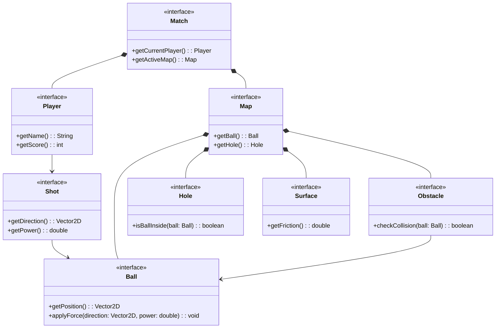
*Figura 1: Schema UML dell’analisi del dominio, con rappresentate le entità principali ed i rapporti fra loro.*

# Capitolo 2: Design

## 2.1 Architettura
Il software segue il pattern architetturale MVC (Model-View-Controller).

**Model**: contiene lo stato del gioco e le regole, senza alcuna dipendenza dalla view o dal controller. Le entità principali sono GameMap (la mappa corrente con pallina, buca, superfici e ostacoli), GameState (lo stato del turno: giocatore attivo, contatore colpi, movimento della pallina) e ShotState (lo stato del colpo in corso: direzione, potenza, posizione della pallina).

**Controller**: coordina model e view senza che i due si conoscano direttamente. La logica di controllo è strutturata gerarchicamente per separare nettamente le responsabilità:
- MainController: Inizializza i componenti principali e ospita il Game Loop tramite un Timer.
- MatchManager: agisce da supervisore della sessione di gioco. Inizializza le partite e gestisce le transizioni logiche tra una buca e l'altra.
- GameController: gestisce il ciclo di vita della singola mappa attiva. Ad ogni tick ricevuto dal MainController, aggiorna la simulazione fisica della pallina, verifica le condizioni di vittoria (ingresso in buca) e delega l'avanzamento dei turni.
- NavigationController: si occupa di gestire le transizioni tra i vari pannelli della view nella MainWindow.

**View**: MainWindow ospita i pannelli tramite un CardLayout; GamePanel compone la mappa di gioco (MapPanel) e l'overlay di input (ShotViewPanel). 

Il controller non dipende mai dalla view concreta: comunica con essa unicamente tramite interfacce strette e callback funzionali (Runnable, Consumer, Supplier). Ciò implica che sostituire Swing con un'altra libreria grafica (ad esempio JavaFX) non richiederebbe alcuna modifica al controller né al model: sarebbe sufficiente riscrivere i pannelli della view e ricablare i callback al momento della costruzione.


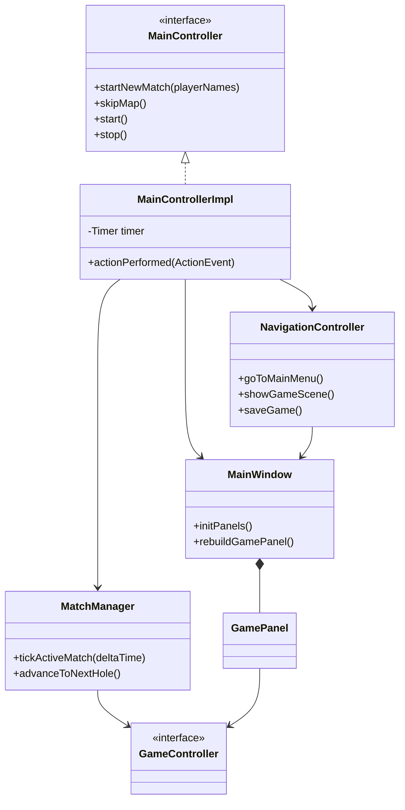
*Figura 2: Schema UML del design dell'architettura, con rappresentate le classi principali ed i rapporti fra loro.*

## 2.2 Design dettagliato

### 2.2.1 Daniel Patryk Bak
#### Gestione dei pannelli
##### Problema
Come ogni gioco, anche mini-gOOlf necessita di un menu principale da cui poter transitare tra diverse "scene", in questo caso i pannelli. È fondamentale rispettare il pattern MVC, assegnando ad un controller la gestione delle transizioni dei pannelli (view).

##### Soluzione
Per poter rendere questa transizione il più semplice e fluida possibile, si è scelto il CardLayout, mentre per pannelli che devono appararire soltanto in sovraimpressione (quali `PausePanel` e `MidLeaderBoardPanel`) si è scelto il metodo Glasspane della libreria Swing. I pannelli vengono illustrati all'interno della `MainWindow` ovvero la finestra dell'intera applicazione.

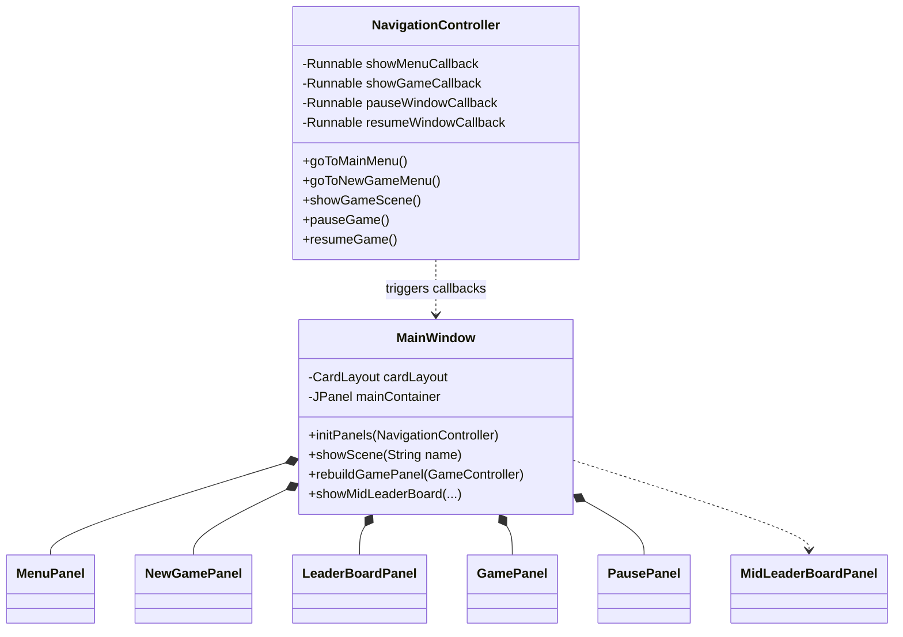
##### Pro e Contro:

Pro:
- Disaccoppiamento netto (Zero EI2): Il NavigationController gestisce la logica di routing senza mai possedere un riferimento diretto alla MainWindow o ai pannelli. La comunicazione avviene esclusivamente tramite callback funzionali (Runnable e Consumer), garantendo che il controller non possa manipolare impropriamente lo stato interno della View.
- Efficienza del CardLayout: I pannelli statici (Menu, New Game, Leaderboard) vengono istanziati una sola volta e mantenuti in memoria. Il CardLayout si limita a nasconderli o mostrarli, rendendo le transizioni di scena istantanee senza sovraccaricare il Garbage Collector.
- Gestione nativa degli Overlay: L'utilizzo del GlassPane per il PausePanel e il MidLeaderBoardPanel permette di sovrapporre interfacce trasparenti al gioco in esecuzione senza dover alterare la gerarchia dei componenti del GamePanel o gestire complessi Z-index. Inoltre, il GlassPane intercetta nativamente gli eventi del mouse, bloccando in automatico le interazioni accidentali con il gioco sottostante in pausa.

Contro:

- Limitazione strutturale del GlassPane: La libreria Swing consente a un JFrame di avere un solo GlassPane attivo per volta. Questo costringe ad implementare una logica di salvataggio e ripristino manuale (come visibile nel metodo showMidLeaderBoard) nel caso in cui più overlay debbano susseguirsi o sovrapporsi.
- Prolissità del costruttore: L'estrazione di tutti i comportamenti della finestra sotto forma di callback rende il costruttore del NavigationController leggermente prolisso e dipendente dal corretto "cablaggio" iniziale.

#### Multiplayer
##### Problema
Il gioco ha la possibilità di avviare una partita singleplayer indicando un solo giocatore nel numero dei giocatori quando richiesto, la partita multiplayer parte quando questi sono 2 o più. 


##### Soluzione

#### Leaderboard


##### Problema
In un gioco competitivo a turni, è essenziale fornire ai giocatori un feedback continuo sul loro andamento relativo (durante la partita) e un senso di progressione e sfida a lungo termine (a partita conclusa). Il problema progettuale risiede nel separare la logica di calcolo e persistenza dei punteggi dalla loro rappresentazione visiva, garantendo al contempo due visualizzazioni distinte: un riepilogo temporaneo alla fine di ogni singola buca e una classifica globale, persistente su file, accessibile dal menu principale.

##### Soluzione
Si è deciso di suddividere la responsabilità in tre componenti chiave, mantenendo un rigido disaccoppiamento:

- Model (Gestione dei dati): La classe LeaderBoardManager gestisce la persistenza dei dati su un file di testo locale (leaderboard.txt). Implementa la logica di dominio per l'aggiornamento dei record, assicurandosi di sovrascrivere il punteggio di un giocatore storico solo se il nuovo punteggio ottenuto è inferiore (migliore) del precedente.

- View (Feedback a fine buca): Il MidLeaderBoardPanel funge da overlay transitorio (tramite GlassPane). Al termine di ogni buca, riceve una mappa non persistente con i colpi attuali della partita in corso, li ordina dinamicamente in memoria e li mostra a schermo, inibendo i clic sul gioco sottostante tramite un MouseAdapter vuoto.

- View (Classifica Globale): Il LeaderBoardPanel è una scena dedicata all'interno del CardLayout. Riceve i dati storici dal Controller (che a sua volta interroga il LeaderBoardManager), li ordina in base al punteggio e li rappresenta in una griglia, arricchendo visivamente la Top 3 tramite icone specifiche (medaglie).


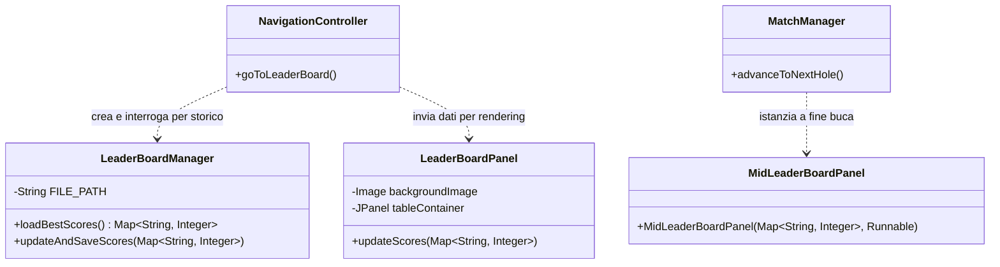

*Pro e Contro*: 

Pro:
- Resilienza e Semplicità: L'utilizzo di un file di testo semplice (.txt) con codifica Chiave:Valore per il salvataggio rende il sistema di I/O rapido, robusto e facilmente ispezionabile senza la necessità di includere librerie di database esterne.

- Riutilizzo del layout: Entrambi i pannelli grafici (LeaderBoardPanel e MidLeaderBoardPanel) si affidano a un GridLayout dinamico che scala automaticamente le righe in base al numero di giocatori in mappa o registrati nel file, garantendo consistenza visiva.

Contro: 
- Manipolazione esterna: Essendo i punteggi globali salvati in chiaro in un semplice file di testo, un utente malevolo potrebbe facilmente aprire il file leaderboard.txt e modificare i record manualmente.

- Ordinamento ripetuto: Attualmente, l'ordinamento della mappa (conversione in List<Map.Entry> e successiva sort) viene delegato alla View (LeaderBoardPanel e MidLeaderBoardPanel) al momento del rendering. A livello architetturale "purista", sarebbe stato preferibile che il Model restituisse una struttura dati già ordinata (es. una lista di Record), sollevando l'interfaccia grafica da calcoli di manipolazione dati.


### 2.2.2 Giacomo Mengozzi

#### Superfici avanzate
##### Problema
Il gioco richiede superfici con proprietà fisiche diverse (attrito, accelerazione, vento) che influenzano il moto della pallina. Le 4 superfici base (erba, sabbia, ghiaccio, terra) differiscono solo per il coefficiente di attrito, mentre le superfici avanzate (`BoostSurface`, `WindySurface`) alterano la velocità con modalità diverse. È necessario aggiungere questi comportamenti senza duplicare la logica già presente nelle superfici base.

##### Soluzione
È stato adottato il **Decorator Pattern**: l'interfaccia `Surface` è implementata sia da `ShapedSurface` (la superficie base, che delega il test di contenimento a un'istanza di `Shape`) sia da `AbstractSurfaceDecorator` (che avvolge qualsiasi `Surface` e ne delega per default tutti i metodi). `BoostSurface` e `WindySurface` estendono il decoratore astratto sovrascrivendo rispettivamente `getFriction()` e `getWind()`. Il motore fisico (`BasicFrictionStrategy`) interroga la superficie corrente tramite questi metodi, senza conoscere se sia base o decorata.

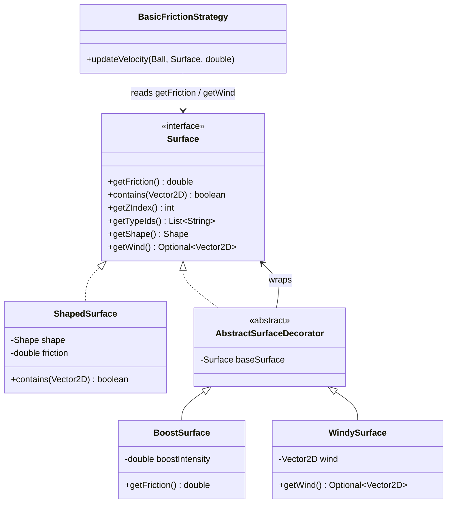

##### Pro e Contro
**Pro:**
* **Componibilità**: è possibile decorare ricorsivamente una stessa superficie con più effetti (es. `BoostSurface` su `WindySurface` su `ShapedSurface`).
* **DRY**: i decoratori riutilizzano la logica geometrica e di contenimento della superficie base, sovrascrivendo solo il parametro fisico di loro competenza.

**Contro:**
* La creazione di superfici composite è verbosa; è necessaria una `SurfaceFactory` per mediare la costruzione.

---

#### Fisica della pallina e integrazione Model–Controller

##### Problema
`PhysicsEngine` (Model) richiede un oggetto `Ball` per leggere posizione/velocità e aggiornarne lo stato ad ogni tick. Lo stato reale della pallina è però custodito nel Controller tramite `BallController`. Esistono due approcci immediati ma chiaramente architetturalmente inesatti:
* duplicare lo stato creando un oggetto `Ball` separato nel Model (rischio di disallineamento);
* far dipendere `PhysicsEngine` da `BallController` (viola la separazione MVC).

##### Soluzione
Il pattern **Adapter** è implementato dalla classe package-private `BallControllerAdapter`: implementa `Ball` delegando ogni lettura e scrittura direttamente al `BallController` incapsulato. `PhysicsControllerImpl` istanzia l'adapter ad ogni tick e lo passa a `PhysicsEngine`, che opera su un oggetto `Ball` senza sapere nulla del controller.

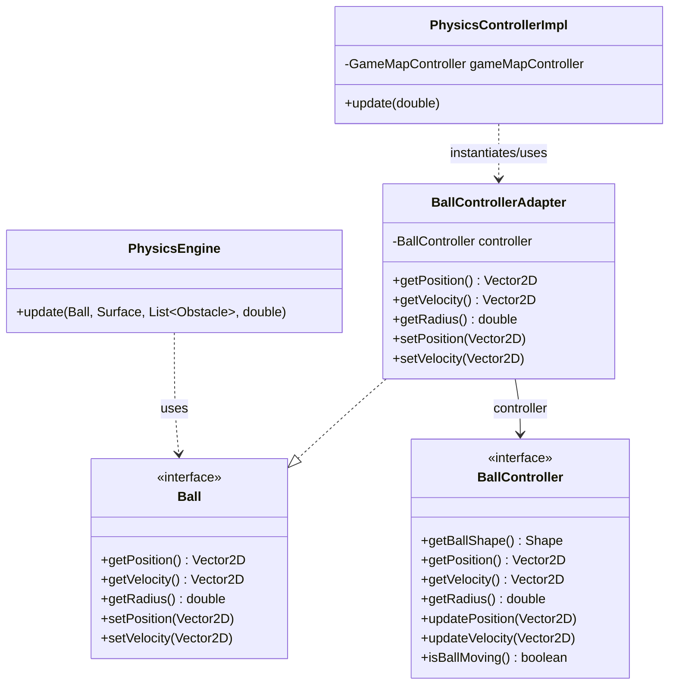

##### Pro e Contro
**Pro:**
* Un'unica istanza della pallina: le modifiche del motore fisico si riflettono immediatamente sul controller, senza sincronizzazione esplicita.
* `PhysicsEngine` dipende solo da `Ball`; `BallController` non conosce il Model. Entrambe le interfacce restano indipendenti.

**Contro:**
* Aggiunge una classe ponte dedicata, giustificata solo dall'architettura MVC.

---

#### Rappresentazione geometrica degli oggetti della mappa

##### Problema
Superfici e buca devono poter verificare se la pallina è al loro interno. La logica geometrica di contenimento deve risiedere nel Model, senza dipendere da classi grafiche Swing; allo stesso tempo la vista deve poter disegnare ciascuna forma nel modo corretto.

##### Soluzione
L'interfaccia `Shape` espone un unico metodo `contains(Vector2D)`. Le implementazioni concrete (`Circle`, `Rectangle`, `Triangle`, `Oval`) sono **Java record** immutabili: garantiscono costruzione valida (tramite costruttori che eseguono un check sulle dimensioni in ingresso), uguaglianza strutturale e assenza di stato mutabile. `ShapedSurface` delega il test di contenimento alla propria `Shape` interna. La vista `MapPanel` recupera le `Shape` tramite il controller e, mediante **pattern matching per `instanceof`** (es. `shape instanceof Circle circ`), determina la geometria concreta ed esegue il disegno specifico senza cast espliciti.

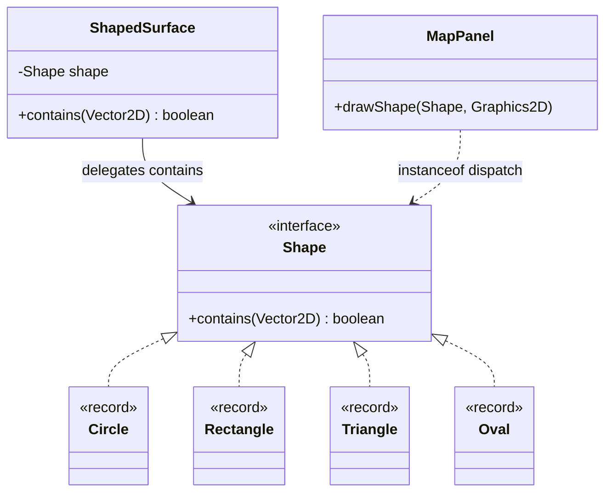

##### Pro e Contro
**Pro:**
* Il Model non ha dipendenze da Swing; `Shape` contiene solo logica matematica.
* I record garantiscono immutabilità e evitano di scrivere manualmente costruttore, getter o `equals`.

**Contro:**
* L'aggiunta di una nuova forma richiede di modificare anche `MapPanel` (violazione dell'OCP); un approccio alternativo sarebbe delegare il rendering con un visitor o un adapter grafico per forma.

### 2.2.3 Federico Sparvoli

#### Input del colpo
##### Problema

Il gioco richiede che il giocatore indichi direzione e potenza del colpo trascinando il mouse dalla pallina. Il sistema deve riconoscere dove inizia il trascinamento, calcolare la direzione e la potenza, mostrare un indicatore visivo, e confermare il colpo solo al rilascio del mouse.

##### Soluzione
La logica è suddivisa in tre livelli distinti seguendo il pattern MVC:
- Model (`ShotState`): tiene traccia dello stato del colpo in corso. Espone lo stato tramite interfacce strette invece che come oggetto diretto, evitando dipendenze scomode.
- View (`ShotViewPanel`, `ShotListener`): `ShotListener` riceve gli eventi del mouse e li traduce in aggiornamenti sul model. Per disegnare l'indicatore e convertire le coordinate non dipende dalla classe concreta `ShotViewPanel`, ma da due interfacce: `ShotVisualizer` (che definisce come mostrare e confermare il colpo) e `ShotCoordinateConverter` (che definisce come tradurre le coordinate del mouse in coordinate di gioco). Queste due interfacce rappresentano le strategie del pattern Strategy, e `ShotViewPanel` ne è l'implementazione concreta: in questo modo il modo di disegnare o di convertire le coordinate può essere cambiato fornendo una nuova implementazione, senza toccare `ShotListener`.
- Controller (`ShotControllerImpl`): ogni tick interroga il model e, se un colpo è pronto, lo passa alla logica di turno tramite callback, senza memorizzare riferimenti a oggetti mutabili.

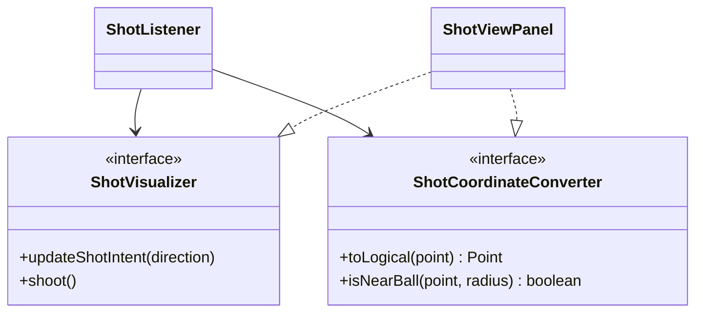

##### Pro e Contro
Pro: separazione netta tra stato, rendering e coordinamento. Aggiungere un nuovo tipo di indicatore visivo richiede solo una nuova implementazione di `ShotVisualizer`, senza toccare il listener o il controller.

Contro: la soglia di click sulla pallina è una costante fissa in pixel logici, e non si adatta automaticamente se la pallina cambia dimensione.

---

#### Ciclo di vita del match e progressione delle mappe

##### Problema
Il gioco deve supportare più mappe in sequenza. Quando la pallina entra in buca si avanza alla mappa successiva, se non ce ne sono, si torna al menu. Tutta questa logica non deve stare nel controller principale, che deve rimanere semplice.

##### Soluzione
La progressione di gioco è gestita da più componenti distinte:
- `MapSequence` (model): tiene la lista delle mappe e sa qual è la corrente. Applica il pattern Factory Method: ogni mappa è prodotta da una `GameMapFactory`, rendendo semplice aggiungerne di nuove.
- `GameMapSequenceFactory`: costruisce la sequenza di mappe tramite un metodo statico (Static Factory Method) che mette sempre la mappa tutorial come prima e mescola le restanti in ordine casuale, così ogni partita è diversa.
- `GameFactory`: costruisce il match per la mappa corrente, collegando tutti i componenti necessari.
- `MatchManager` (controller): usa `GameFactory` per costruire ogni match e gestisce le transizioni tra una mappa e l'altra. Comunica con il resto del sistema solo tramite callback, senza memorizzare oggetti mutabili.

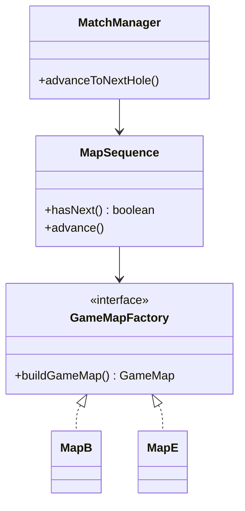

##### Pro e Contro

Pro: aggiungere una nuova mappa richiede solo di creare una nuova classe e aggiungerla alla sequenza. Il reset al ritorno al menu è automatico.

Contro: ad ogni cambio mappa il match viene ricostruito da zero, il che potrebbe rallentare il gioco se le mappe fossero molto complesse.

### 2.2.4 Mattia D'Ambrosio
#### Fisica, geometria degli ostacoli e gestione vettoriale
##### Problema

Gestire le collisioni fisiche tra la pallina e gli ostacoli di forme diverse (rettangoli, cerchi, triangoli) in modo realistico, anche in situazioni critiche come angoli interni tra ostacoli adiacenti o sotto l’effetto di forze esterne, evitando compenetrazioni, vibrazioni della pallina a riposo e rimbalzi innaturali o con direzioni arbitrarie.
Implementare il calcolo vettoriale senza importare librerie esterne pesanti.

##### Soluzione
La classe `AbstractObstacle` centralizza la logica di calcolo del rimbalzo e del contatto a riposo, evitando ripetizioni di codice nelle sottoclassi. Per i calcoli vettoriali viene utilizzata una classe personalizzata `Vector2D`, ispirata all'omonima classe della libreria Apache Commons Math 3, che fornisce solo i metodi essenziali ai calcoli di gioco, mantenendo l'architettura leggera e priva di dipendenze esterne superflue.
Per rendere i rimbalzi deterministici e privi di direzioni arbitrarie, sono state applicate due strategie: 
- Le normali di collisione degli ostacoli sono precalcolate per ogni lato (`WallObstacle`, `TriangleObstacle`) o derivabili geometricamente (`RoundObstacle`). 
- Viene sfruttata la profondità di penetrazione per riposizionare la pallina, o parte di essa, fuori dall'ostacolo, prima di calcolare il rimbalzo; in caso di collisioni multiple, si applica la strategia deepest penetration first, individuando l'ostacolo con la compenetrazione maggiore, estraendone la pallina e ripetendo il controllo iterativamente finché la pallina non risulta completamente fuori da ogni ostacolo.


UML:
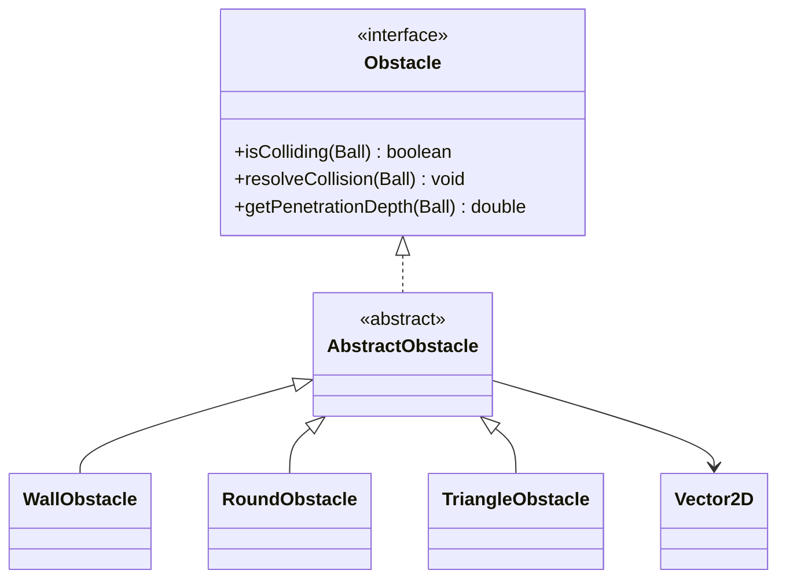

##### Pro e Contro
Pro:
- Fisica altamente stabile e realistica 
- Le normali precalcolate riducono drasticamente i calcoli ripetitivi nel game loop (specialmente nei rettangoli).
- La classe personalizzata 'Vector2D' evita di importare tutti i metodi e campi non necessari all'applicazione, alleggerendola
- Architettura scalabile: l'aggiunta di un nuovo ostacolo richiede solo di estendere 'AbstractObstacle' ed implementare il calcolo di compenetrazione.

Contro:
- Se la velocità della pallina in un singolo frame supera lo spessore dell'ostacolo, rischia di attraversarlo (tunneling).
- Il calcolo esatto delle distanze per i triangoli richiede l'estrazione di radici quadrate, operazione che appesantiscono il game loop.

#### Creazione degli ostacoli avanzati (Appiccicosi, Rimbalzanti e Portali)

##### Problema
Introdurre dinamiche di gioco avanzate tramite ostacoli che alterano la velocità della pallina (appiccicosi che rallentano, respingenti che accelerano) e portali di teletrasporto. Bisognava evitare di creare una nuova classe per ogni combinazione di forma ed effetto, garantire la creazione sicura dei portali solo in coppia e prevenire loop infiniti di teletrasporto nello stesso frame.

##### Soluzione
- Constructor Chaining per l'elasticità: Aggiunto il parametro `bounciness` in `AbstractObstacle`, che scala la velocità al contatto con l'ostacolo senza alterare l'angolo di rimbalzo.
- Aggiunto un secondo costruttore, in ogni classe degli ostacoli, che accetta come parametro 'bounciness' per creare l'ostacolo elastico. In caso di ostacoli con elasticità normale, si utilizza il costruttore base, che chiamerà quello completo impostando 'bounciness' al valore di default.
- Il costruttore di `PortalObstacle` è privato e la creazione è delegata al metodo statico `createPair()`, che istanzia e collega tra loro due portali in memoria, impedendo la configurazione di elementi dispari o spaiati nella mappa.
- Al momento del teletrasporto, il portale di destinazione attiva un 'timer di cooldown'; finché è attivo, la sua compenetrazione risulta nulla, nascondendolo temporaneamente al motore fisico per permettere alla pallina di uscire senza re-innescare il trasferimento.

UML:
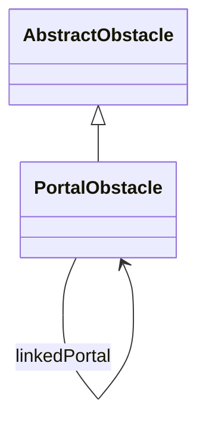

##### Pro e Contro
Pro:
- Architettura estremamente flessibile: gli effetti di accelerazione e decelerazione possono essere applicati a qualsiasi forma geometrica tramite un semplice parametro.
- Sicurezza strutturale nella creazione dei portali, che impedisce stati invalidi come la creazione di portali spaiati.

Contro:
- Il cooldown temporale fisso (es. 500ms) potrebbe scadere prima che la pallina sia uscita dal portale se questa viaggia a una velocità estremamente ridotta, generando un loop.

#### Architettura e separazione Vista‑Logica

##### Problema
La logica di gestione degli ostacoli (collisioni, calcoli fisici, accesso ai dati) deve essere separata dalla rappresentazione grafica e dal resto del gioco, per mantenere un’architettura MVC pulita ed evitare che la vista dipenda direttamente dalle classi del modello.

##### Soluzione
- Introdotto `ObstacleController` che agisce da intermediario isolando i dati fisici da quelli visivi. Espone i metodi `getObstacles()` (per i modelli) e `getObstacleShapes()` (per il rendering).
- Il motore fisico (`PhysicsEngine`) interroga il controller tramite `getObstacles()` per ottenere esclusivamente i modelli matematici necessari a risolvere le collisioni in ogni frame.
- La vista (`MapPanel`) chiede le forme geometriche da disegnare senza conoscere i dettagli interni del modello. Leggendo le proprietà fisiche degli ostacoli (come la `bounciness` o il tipo `PortalObstacle`), la vista decide autonomamente il colore di rendering (verde, rosso, blu o grigio di default) prima di delegare il disegno della forma.

UML:
```mermaid
    classDiagram
        class MapPanel
        <<interface>> ObstacleController
        <<interface>> Obstacle
        <<interface>> Shape

        MapPanel --> ObstacleController
        ObstacleController --> Obstacle
        Obstacle --> Shape
```

##### Pro e Contro
Pro:
- Separazione netta tra modello e vista, che garantisce un'ottima manutenibilità e facilità di test automatizzati.
- Modificare l'aspetto estetico o i colori di un ostacolo richiede modifiche circoscritte alla sola vista, senza rischiare di alterare i calcoli fisici del modello.

Contro:
- L'aggiunta di un controllore dedicato aumenta il numero di interfacce e di file da gestire nel progetto, rendendo l'architettura iniziale più complessa da configurare.
- La vista ('MapPanel') deve comunque guardare dentro le proprietà del modello (usando controlli come 'instanceof' o leggendo la 'bounciness') per decidere il colore da associare, creando un legame tra l'aspetto grafico e la logica interna degli ostacoli.

---

# Capitolo 3: Sviluppo

## 3.1 Testing automatizzato
### 3.1.1 Daniel Patryk Bak

I componenti testati riguardano la fabbricazione dell'interfaccia utente, l'integrità delle risorse multimediali e la persistenza dei dati:

* **UserInterfaceFactoryTest**: Verifica che tutti i componenti Swing (JButton, JLabel, JTextField) generati dalla factory rispettino rigorosamente le specifiche di design imposte dal gioco, garantendo l'assegnazione corretta dei font personalizzati, delle dimensioni predefinite, dei colori e dei bordi.
* **ResourcePresenceTest**: Assicura l'integrità del pacchetto software, verificando che tutte le risorse statiche vitali per il funzionamento dell'interfaccia (font, soundtrack, texture delle superfici, immagini di sfondo e di tutorial) siano presenti e caricabili correttamente all'interno del Classpath.
* **LeaderBoardManagerTest**: Controlla la logica di aggiornamento e scrittura su file della classifica globale. Tramite un ambiente pulito (creazione e cancellazione del file ad ogni test), verifica la regola di dominio fondamentale: il punteggio storico di un giocatore viene sovrascritto solo se il nuovo punteggio ottenuto è strettamente inferiore (migliore) del precedente.

### 3.1.2 Giacomo Mengozzi
I componenti testati riguardano la pallina, la mappa e le superfici speciali:
* **BallImplTest**: Inizializzazione dello stato (posizione, raggio, velocità), correttezza dei setter e integrazione con `PhysicsEngine`/`BasicFrictionStrategy` per verificare che l'attrito azzeri la velocità; testa inoltre il lancio di `IllegalStateException` per posizioni fuori mappa.
* **GameMapImplTest**: Rifiuto di argomenti `null` nel costruttore e comportamento di `getSurfaceAt` (restituzione della superficie corretta, priorità per z-index più alto, eccezione per punto fuori dai limiti).
* **BoostSurfaceTest**: Validazione del costruttore, calcolo dell'attrito negativo, delega delle proprietà alla superficie base e integrazione con `PhysicsEngine` (accelerazione della pallina in moto, speed cap).
* **WindySurfaceTest**: Validazione del costruttore, correttezza del vettore di vento per direzione, delega delle proprietà e composizione con `BoostSurface` (decorator su decorator).

### 3.1.3 Federico Sparvoli
I componenti testati sono ShotState, GameState e GameFactory.
ShotStateTest: controlla che lo stato del tiro funzioni bene: all'inizio è vuoto, c'è una potenza minima, la potenza massima non si può superare, si può consumare un colpo e si può resettare tutto.

GameStateTest: controlla la logica dei turni: come si crea, come si passa al turno successivo (e si ricomincia da capo dopo l'ultimo), quanti colpi sono stati fatti, e che i colpi troppo deboli o fatti mentre la pallina si muove vengano ignorati.

GameFactoryTest: controlla che la partita creata dalla factory parta sempre in uno stato iniziale corretto su entrambe le mappe: tutti i controller devono essere presenti, il primo giocatore è quello giusto, e lo stato del tiro è vuoto.

### 3.1.4 Mattia D'Ambrosio
I componenti testati riguardano la geometria computazionale e la fisica delle collisioni: Vector2D, Obstacle (con le sue classi concrete) e ObstacleController.

Vector2DTest: Controlla la correttezza di tutte le operazioni algebriche fondamentali sui vettori custom (somma, sottrazione, normalizzazione, prodotto scalare, distanza euclidea e gestione dei limiti della precisione floating-point tramite EPSILON).

ObstacleCollisionTest: Verifica l'accuratezza del calcolo delle collisioni e della profondità di penetrazione per WallObstacle, RoundObstacle e TriangleObstacle. Testa i casi limite, come l'allineamento perfetto dei centri, l'impatto sugli spigoli vivi e l'espulsione fisica della pallina quando si trova sia all'esterno che completamente all'interno dei solidi.

ObstacleControllerTest: Assicura il corretto funzionamento del controller come intermediario. Verifica che la lista dei modelli matematici (Obstacle) e delle forme grafiche (Shape) siano popolate coerentemente e che il motore fisico riceva i dati corretti per la risoluzione dei contatti in ogni frame.

## 3.2 Note di sviluppo
### 3.2.1 Daniel Patryk Bak
- Factory
- lambda expression
...
### 3.2.2 Giacomo Mengozzi
#### Java Records
Permalink: https://github.com/jjacomo/OOP25-mini-gOOlf/blob/a03bd528fdd870c74b8574f68c74972313d66720/src/main/java/it/unibo/minigoolf/util/shapes/Circle.java#L17
#### Java Reflection API
Permalink: https://github.com/jjacomo/OOP25-mini-gOOlf/blob/5f753c229d34960fe24214219c043168836aa14d/src/main/java/it/unibo/minigoolf/view/panels/MapPanel.java#L154
#### Stream API e lambda expressions
Permalink: https://github.com/jjacomo/OOP25-mini-gOOlf/blob/a03bd528fdd870c74b8574f68c74972313d66720/src/main/java/it/unibo/minigoolf/model/map/GameMapImpl.java#L54
#### Optional
Permalink: https://github.com/jjacomo/OOP25-mini-gOOlf/blob/a03bd528fdd870c74b8574f68c74972313d66720/src/main/java/it/unibo/minigoolf/model/surfaces/Surface.java#L60
https://github.com/jjacomo/OOP25-mini-gOOlf/blob/a03bd528fdd870c74b8574f68c74972313d66720/src/main/java/it/unibo/minigoolf/model/physics/velocity/BasicFrictionStrategy.java#L67
#### Utilizzo della libreria SLF4J
Ad esempio in https://github.com/jjacomo/OOP25-mini-gOOlf/blob/a03bd528fdd870c74b8574f68c74972313d66720/src/main/java/it/unibo/minigoolf/model/physics/PhysicsEngine.java#L62

### 3.2.3 Federico Sparvoli

#### Lambda expressions e method reference
Utilizzate per passare comportamenti e dipendenze in modo semplice e flessibile. GameControllerImpl non memorizza né GameState né PhysicsController direttamente, ma ne estrae i comportamenti come BooleanSupplier, Runnable, Consumer<Vector2D> e Supplier<Optional<Vector2D>>, eliminando i warning SpotBugs EI_EXPOSE_REP2 senza fare uso di alcun @SuppressWarnings.
Permalink:  https://github.com/jjacomo/OOP25-mini-gOOlf/blob/87cc252b172c4386b3ddc03454383d9d96ed44cf/src/main/java/it/unibo/minigoolf/controller/game/GameControllerImpl.java#L104
    https://github.com/jjacomo/OOP25-mini-gOOlf/blob/87cc252b172c4386b3ddc03454383d9d96ed44cf/src/main/java/it/unibo/minigoolf/controller/game/MatchManager.java#L78

#### Java Records
SaveData e PlayerSaveData sono record utilizzati per rappresentare dati in modo semplice e immutabile.
Permalink: https://github.com/jjacomo/OOP25-mini-gOOlf/blob/87cc252b172c4386b3ddc03454383d9d96ed44cf/src/main/java/it/unibo/minigoolf/model/save/SaveData.java#L21

#### Stream API
Usata in GameState per costruire la lista dei giocatori nel costruttore, in GameControllerImpl per produrre gli snapshot dei giocatori in createSaveData, e in MatchManager per avanzare la sequenza di mappe al caricamento di un salvataggio.
Permalink: https://github.com/jjacomo/OOP25-mini-gOOlf/blob/87cc252b172c4386b3ddc03454383d9d96ed44cf/src/main/java/it/unibo/minigoolf/model/logic/GameState.java#L43 //T    ODO

#### Optional
Usato in ShotState per indicare se c'è o meno un'intenzione di tiro, posizione della palla e colpo pronto, rendendo esplicito il ciclo di vita del colpo ed evitando controlli su null.
Permalink: https://github.com/jjacomo/OOP25-mini-gOOlf/blob/87cc252b172c4386b3ddc03454383d9d96ed44cf/src/main/java/it/unibo/minigoolf/model/logic/ShotState.java#L68

#### Libreria Gson (com.google.code.gson) 
Usata in SaveManager per serializzare e deserializzare lo stato della partita in JSON con GsonBuilder.setPrettyPrinting().
Permalink: https://github.com/jjacomo/OOP25-mini-gOOlf/blob/87cc252b172c4386b3ddc03454383d9d96ed44cf/src/main/java/it/unibo/minigoolf/model/save/SaveManager.java#L21

### 3.2.4 Mattia D'Ambrosio
Pattern Template Method: Utilizzati nella gerarchia degli ostacoli per massimizzare il riutilizzo del codice (DRY). La classe astratta AbstractObstacle definisce lo scheletro dell'algoritmo di calcolo del rimbalzo e della correzione della posizione (metodo 'reflectVelocity'), lasciando alle classi concrete solo il compito di implementare le specificità geometriche di calcolo della penetrazione e delle normali.

Constructor Chaining: Applicato in tutte le classi degli ostacoli per introdurre la 'bounciness', garantendo la compatibilità con il codice già esistente. I costruttori base delegano la creazione a costruttori più completi passando automaticamente il valore di default, evitando ridondanze o controlli duplicati.

Pattern Static Factory Method: Utilizzato nella classe PortalObstacle. Avendo reso privato il costruttore, la creazione dei portali è vincolata al metodo statico 'createPair()'. Questo approccio impedisce la configurazione di stati invalidi nel sistema, come la presenza di portali dispari, spaiati o non collegati bidirezionalmente in memoria.

System Timestamping: Sfruttato all'interno della gestione dei portali tramite 'System.currentTimeMillis()' per implementare un meccanismo di cooldown temporale deterministico. Questo permette di disattivare temporaneamente la fisica di un portale per una finestra temporale fissa, prevenendo loop infiniti di teletrasporto nello stesso frame.

---

# Capitolo 4: Commenti finali

## 4.1 Autovalutazione e lavori futuri
### 4.1.1 Daniel Patryk Bak
### 4.1.2 Giacomo Mengozzi
Sono molto soddisfatto del contributo fornito al progetto, non soltanto per il lavoro realizzato, ma soprattutto per l'esperienza maturata durante l'intero percorso di sviluppo. Il tempo e le energie investite sono stati considerevolmente superiori alle aspettative iniziali, ma ritengo che siano stati impiegati in modo proficuo.
Dal punto di vista tecnico, mi sono occupato dell'implementazione delle superfici, della mappa e della buca, nonché della loro integrazione nelle mappe di gioco, coordinando l'interazione tra questi elementi secondo le leggi della fisica.
Le difficoltà maggiori hanno riguardato la comprensione e l'applicazione del pattern architetturale MVC nei suoi tre livelli, in particolare per quanto concerne la comunicazione tra le rispettive classi. A queste si è aggiunta la sfida di approcciare il progetto partendo da un'esperienza di programmazione quasi nulla, il che ha reso la fase iniziale particolarmente impegnativa.
Con il progredire del lavoro, tuttavia, la padronanza degli strumenti e delle pratiche di sviluppo è cresciuta progressivamente, consentendo di scrivere codice con maggiore consapevolezza. Il risultato finale e le soluzioni adottate riflettono l'impegno costante nel rispettare i principi della buona programmazione orientata agli oggetti.

### 4.1.3 Federico Sparvoli
Il mio contributo principale riguarda il sistema di input del colpo, la gestione del ciclo di vita dei match e il sistema di salvataggio. Sono soddisfatto della separazione raggiunta tra model, view e controller, in particolare dell'eliminazione di tutti i warning SpotBugs senza ricorrere a @SuppressWarnings, ottenuta tramite interfacce strette e callback funzionali.
Una scelta progettuale che ho fatto è stata quella di rendere synchronized i metodi pubblici di ShotState e di marcare volatile il campo che segnala se la pallina è in movimento in GameState. Attualmente gli aggiornamenti del gioco e la gestione dell'input avvengono in modo sequenziale, all'interno dello stesso gameloop, quindi queste precauzioni non sono necessarie, ma le ho comunque inserite per rendere le classi più robuste, qualora in futuro il gioco venisse esteso con thread.
Un aspetto migliorabile è la soglia di click sulla pallina (CLICK_RADIUS), che al momento è un numero fisso di pixel e non cambia se la pallina viene ingrandita o rimpicciolita. In futuro sarebbe meglio calcolarlo in base al raggio vero della pallina.
Per quanto riguarda il cambio delle mappe, al momento ricostruiamo da capo tutto il controller del gioco ad ogni nuova mappa. Con mappe molto grandi questo potrebbe rallentare il gioco. Il prossimo passo sarebbe caricare le mappe in anticipo, senza bloccare il gioco.
Il sistema di salvataggio (SaveManager, SaveData) memorizza la partita in formato JSON usando Gson. Salva solo il numero della mappa, non tutta la geometria. Così i file sono piccoli e il salvataggio non dipende da come sono fatte le mappe dentro. Un limite attuale è che il salvataggio viene cancellato appena lo si carica, quindi non si può riprendere la stessa partita due volte senza salvarla di nuovo.

### 4.1.4 Mattia D'Ambrosio
Il mio contributo principale ha riguardato l'architettura geometrico-matematica degli ostacoli, lo sviluppo della classe vettoriale dedicata e l'implementazione della fisica delle collisioni e degli elementi avanzati (ostacoli elastici e portali). Sono pienamente soddisfatto della stabilità raggiunta nel calcolo delle penetrazioni e dell'algoritmo di Normal Blending per la risoluzione deterministica degli angoli interni, che ha rimosso qualsiasi arbitrarietà fisica. Dal punto di vista architetturale, l'introduzione di ObstacleController ha garantito un disaccoppiamento MVC pulito tra modelli fisici e rendering grafico.

Un aspetto decisamente migliorabile riguarda il fenomeno del tunneling: se la pallina si muove a una velocità talmente elevata da superare lo spessore di un ostacolo sottile in un singolo frame, il motore manca la collisione attraversando l'oggetto. In futuro, per ovviare a questo problema, si potrebbe implementare un algoritmo di Continuous Collision Detection (CCD) basato sul raycasting o sul campionamento della traiettoria.

Un altro limite risiede nel meccanismo di cooldown temporale dei portali; sebbene la soglia fissa a 500ms sia efficace nella maggior parte dei contesti, se la pallina entra in un portale a velocità quasi nulla rischia di rimanere ferma sulla destinazione oltre la scadenza del timer, riattivando un loop infinito. Un'evoluzione futura prevedrebbe un'immunità basata sulla geometria, disattivando il cooldown solo quando la pallina ha fisicamente interrotto la collisione con la bounding box del portale di arrivo.

---

# Appendice A
### Guida Utente

* **Menu Iniziale:** 
Avviando il gioco viene mostrato il menu principale dal quale è possibile iniziare una nuova partita premendo il tasto `PLAY`;  bisognerà poi scegliere il numero di giocatori, premere il tasto `OK` ed inserirne i nomi. Infine, premere `START MATCH`. Se è presente una partita salvata, il gioco chiederà se la si vuole caricare o iniziarne una nuova. Dal menu è inoltre possibile consultare la classifica finale delle partite precedenti tramite il tasto `LEADERBOARD`.

* **Controlli In-Game:** 
Per effettuare un colpo è necessario cliccare e tenere premuto il mouse sulla pallina, per poi trascinare nella direzione opposta a quella in cui si vuole colpire. Più lungo è il trascinamento, più potente sarà il colpo. Rilasciare il mouse per confermare il colpo.
Un indicatore colorato mostra la direzione e la potenza: verde per colpi deboli, giallo per colpi medi, rosso per colpi forti.

* **Regole:**
Ogni giocatore ha a disposizione al massimo 7 colpi per buca. Se non si entra in buca entro il limite, il turno passa al giocatore successivo (o, in caso di singleplayer, si passa alla mappa successiva). Il punteggio di ogni giocatore corrisponde al numero di colpi effettuati su ciascuna mappa e meno colpi si fanno, meglio è. Al termine di ogni mappa viene mostrata una classifica intermedia e una volta completate tutte le mappe, il punteggio finale viene salvato nella classifica globale.

* **Pausa:**
Durante il gioco è possibile mettere in pausa premendo il tasto ESC, purché la pallina non sia in movimento. Dal menu di pausa è possibile riprendere la partita, skippare la mappa attuale, consultare il tutorial o tornare al menu principale.

# Appendice B
### Esercitazioni di laboratorio

**B.0.1** federico.sparvoli@studio.unibo.it
* Laboratorio 06: https://github.com/fedesparvo1-a11y/lab06
* Laboratorio 07: https://github.com/fedesparvo1-a11y/lab07
