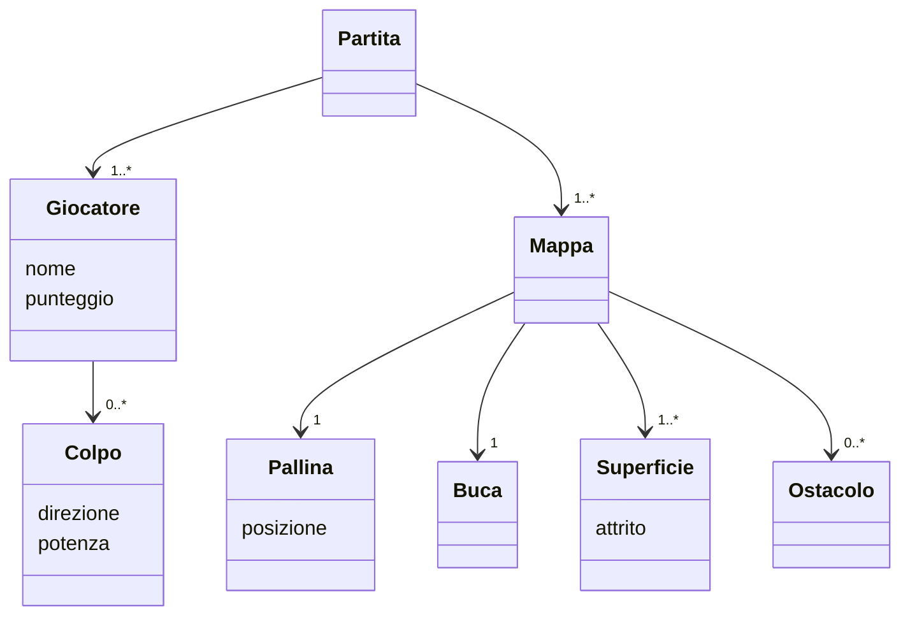
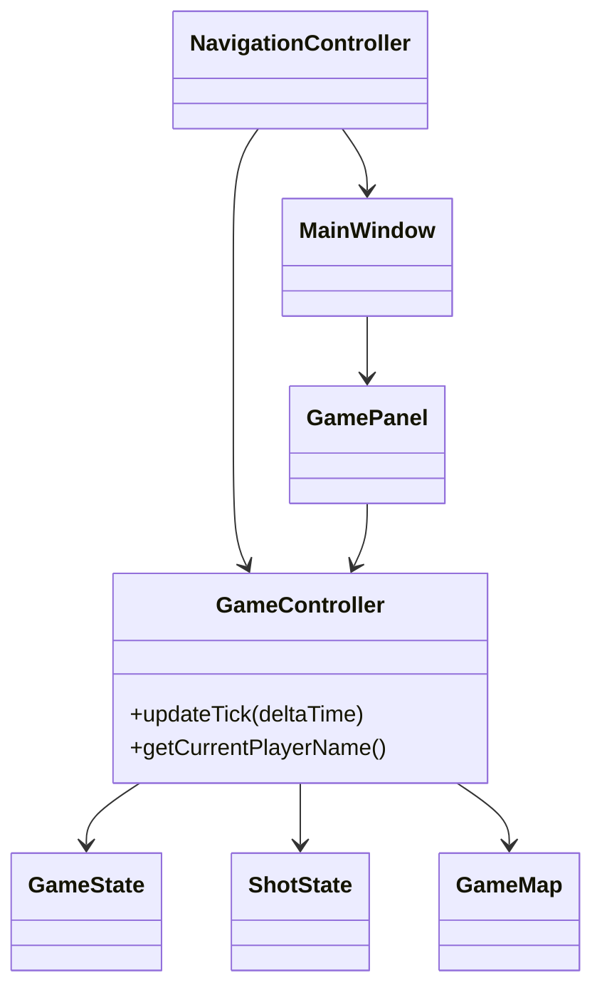

## 1.2 Modello del Dominio

-- fede --
Un gioco di mini-golf è composto da una sequenza di mappe. Ogni mappa contiene una pallina, una buca, un insieme di superfici e un insieme di ostacoli. La pallina si muove sulla mappa seguendo le leggi della fisica: la superficie su cui si trova influenza il suo movimento tramite l'attrito e, in alcuni casi, il vento. Gli ostacoli bloccano il percorso della pallina facendola rimbalzare e in alcuni casi ne alterano la velocità.
Una partita coinvolge uno o più giocatori che si alternano a turni. Ad ogni turno il giocatore effettua un colpo, indicando direzione e potenza. Il punteggio di ciascun giocatore su una mappa corrisponde al numero di colpi effettuati. L'obiettivo è far entrare la pallina nella buca.

UML:

-- jack -- (Quella di fede per me va bene, forse riassumerei ancora un po'...)

Un gioco di mini-golf è composto da una sequenza di mappe. Ogni mappa contiene una pallina, una buca, un insieme di superfici e un insieme di ostacoli. La pallina si muove sulla mappa interagendo con superfici e ostacoli che ne modificano velocita' e direzione.
Una partita coinvolge uno o più giocatori che si alternano a turni. Ad ogni turno il giocatore effettua un colpo, indicando direzione e potenza. Il punteggio di ciascun giocatore su una mappa corrisponde al numero di colpi effettuati. L'obiettivo è far entrare la pallina nella buca.

## 2.1 Architettura

-- fede --
Il software segue il pattern architetturale MVC (Model-View-Controller).

Model: contiene lo stato del gioco e le regole, senza alcuna dipendenza dalla view o dal controller. Le entità principali sono GameMap (la mappa corrente con pallina, buca, superfici e ostacoli), GameState (lo stato del turno: giocatore attivo, contatore colpi, movimento della pallina) e ShotState (lo stato del colpo in corso: direzione, potenza, posizione della pallina)

Controller: coordina model e view senza che i due si conoscano direttamente. GameController gestisce il ciclo di vita di un singolo match: riceve i tick del game loop, aggiorna la fisica, rileva l'ingresso in buca e gestisce i turni. MatchManager gestisce la progressione tra le mappe. NavigationController gestisce le transizioni tra i pannelli dell'interfaccia e il salvataggio della partita

View: MainWindow ospita i pannelli tramite un CardLayout, mentre GamePanel mostra la mappa e le informazioni di gioco. La view non contiene logica: legge lo stato tramite callback forniti dal controller.
Il controller non dipende mai dalla view concreta: comunica con essa solo tramite interfacce strette e callback funzionali. 

Sostituire Swing con un'altra libreria grafica (ad esempio JavaFX) non richiederebbe alcuna modifica al controller né al model

UML:
